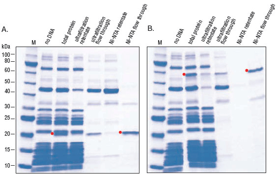

**********************************
Purify Zif268-repA via reverse His
**********************************

Now that I'm able to express Zif268-repA in vitro, I'd like to be able to 
purify it from the transcription/translation components.  This purification 
isn't strictly necessary for either my ligase or DNase assays, but it is 
preferable.  The IVTT mix contains proteins/RNAs/complexes that bind DNA, and 
could therefore potentially interfere with the assay.  Pure protein would also 
make it easier for me to validate my display techniques, because I could run 
gels with less background.

I've tried the reverse His-tag purification `described by NEB`__ once 
unsuccessfully (data not shown).  I want to start by making sure I can 
successfully purify the test protein before moving on to my Zif268-repA fusion.  
There are a few problems I can foresee:

__ https://www.neb.com/protocols/0001/01/01/purification-of-synthesized-protein-using-reverse-his-tag-purification-e3313

- The Zif269-repA fusion bound to the ORI might be above the 100 kDa MW cutoff 
  for the Amicon spin filters.  Zif268-repA is 44 kDa itself, and the 1590 bp 
  gene (containing CIS and ORI) is 491 kDa.  
  
  - If this is the case, I should be able to purify the DHFR control and the 
    11-ORI construct, but not the 11 or 15 constructs.
    
  - I also wonder if I could somehow digest the ribosomes and then use the 100K 
    spin columns to keep only my protein.

  - The 30 kDa spin column `retains dsDNA molecules as small as 137 bp 
    <http://www.emdmillipore.com/US/en/20140318_170505>`_.  Likely the 100K 
    spin column will retain all of the Zif268-repA gene.

  - The Invitrogen RiboMinus Transcriptome Isolation Kit (K155004) might be a 
    way to get rid of the ribosomes.  I briefly looked at the protocol, and the 
    steps seem gentle enough.  I'd dilute the sample a lot, but fortunately I 
    can concentrate them with the spin columns.

- The protein might not completely dissociate from the ribosome.

  - The NEB protocol mentions this problem, and recommends (if necessary) 
    adding up to 400 mM NaCl to help dissociate the complex.  This might then 
    require subsequent dialysis.

2019/06/25
==========
I'm actually pretty certain that the 11 and 15 constructs won't fit through the 
spin filters (as described above), but I want to see if I can get the reverse 
purification protocol to work for the controls (DHFR and 11 - ORI), since I've 
had trouble with them before (data not shown).  If I can't get the controls to 
work, that might mean that something more significant is going wrong.

.. protocol:: 20190625_purexpress.txt

.. protocol:: 20190625_neb_e6800_reverse_his.txt

.. figure:: 20190626_purify_controls.svg

   DHFR and 11 - ORI (Zif-repA) control reactions.  Bolt MES SDS-PAGE.  165V 
   for 1h.  

   `From NEB.`__  125 μl reactions were carried out according to 
   recommendations in the accompanying manual. Samples were analyzed on a 
   10–20% Tris-glycine gel and stained with Coomassie Blue. Note that in both 
   cases, the desired protein can be visualized in the total protein fraction.  
   The red dot indicates the protein of interest. Marker M is the Protein 
   Ladder (NEB #P7703).

   __ https://www.neb.com/products/e6800-purexpress-invitro-protein-synthesis-kit#Product%20Information

I was able to purify DHFR reasonably well.  My bands are fainter than those 
from the NEB gel because my reactions were smaller, but the pattern of bands 
looks about the same.  

I was not able to purify Zif268-repA.  Zif268-repA was expressed well, but 
unlike DHFR, was retained by the spin filters.  Some possible explanations:

1. I accidentally used 11 instead of 11-ORI.  I don't have anything confirming 
   that I used 11-ORI, but I don't think I made this mistake.

   .. update:: 2019/06/27

      I definitely did not make this mistake.  I put away the tubes from this 
      experiment in a different place than usual, so I can confirm that I 
      definitely used 11-ORI.
   
2. Zif268-repA doesn't pass through the spin filter, despite being only 44 kDa.  
   For comparison, the dark band just larger than Zif268-repA is partially 
   retained by the filter.  Perhaps something about the shape/charge of 
   Zif269-repA makes it more likely to be retained.

3. Zif268-repA doesn't dissociate from the ribosome (but DHFR does).

4. Zif268 is binding the Zif268-repA gene.  I checked for exact sites and 
   didn't find any, but there are some GC-rich regions (e.g. ``GCGGTGGGC``) 
   that Zif268 could have affinity for, especially given a high concentration 
   of DNA.  If this is the case, I should be able to release the protein from 
   the DNA by adding free target sequence.  This would probably interfere with 
   downstream steps, and not really be practical when working with libraries of 
   protein variants with different specificities, but it would be good to know 
   what's going on.

5. repA is binding the Zif268-repA gene.  I thought I could prevent this from 
   happening by not including the ORI sequence, but if repA does have the 
   ability to nonspecifically bind to DNA, that could be a problem going 
   forward.

2019/06/27
==========
Today I want to try:

- Adding DNase before the purification, to see if Zif268-repA binding to any 
  DNA is the problem.

- Adding NaCl to the purification (as recommended by NEB) to encourage 
  dissociation from the ribosome.  Note that NaCl could also encourage 
  dissociation from any DNA bound by the complex, so a positive result for this 
  experiment would be hard to interpret.

.. protocol:: 20190627_purexpress.txt

.. protocol:: 20190627_neb_e6800_reverse_his.txt

   - I forgot to take an aliquot of the crude reaction.

   - Setup the DNase and NaCl treatments:

      .. datatable:: 20190627_dnase_nacl_treatment.xlsx

         For water and NaCl, volumes are: normal salt/high salt

   - Incubate at 37°C for 10 min.

   - Take 10 μL aliquots of the 100K retentate and flow-through.
     
   - Take 15 μL aliquots of the Ni-NTA eluate.

   - SDS-PAGE

.. figure:: 20190628_reverse_his_dnase_nacl.svg

   The DHFR and 11-ORI samples were purified using the reverse-His protocol as 
   it's described by NEB.  The Dnase and NaCl samples both contained the 11-ORI 
   construct, but were purified by modified protocols.  DNase: Reaction treated 
   with DNase I before purification.  NaCl: Reaction brought to the maximum 
   NaCl concentration recommended by NEB (400 mM) before being applied to the 
   spin column.  The MWs of Zif268-repA (44 kDa) and DHFR (18 kDa) are shown in 
   parentheses.

- I'm annoyed that I forgot to save some of the crude reaction.  The 
  Zif268-repA band is present, but weak, in the retentate.  Without the crude 
  reaction, it's hard to conclude anything, because I may just not have gotten 
  good expression for whatever reason.  

- But looking at the gel from 6/25/19, the pattern is similar.  There seems to 
  be more product in the crude reaction than in the 100K retentate and 
  flow-through combined.  

So where did the Zif268-repA go?  

- Maybe it's in the retentate, but just too dilute to see.  In this scenario, 
  the Zif268-repA gets split between the two fractions, so appears diluted in 
  both.  I do think there are a lot of things in the flow-through that I'm just 
  not seeing.

- Maybe it's getting stuck to the filter.  I can't explain why my protein would 
  be getting stuck so much more than any of the other proteins seem to be, but 
  this is a possibility.

Results
=======
The reverse-His purification protocol will not be useful for my repA fusions, 
because the fusions don't pass through the 100K spin filter.  Also, 11-ORI does 
not behave how I expect it to (in that it may be binding DNA), which makes it a 
poor control.
