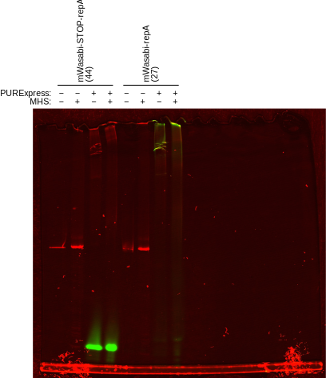

*************************
Release repA with heparin
*************************

My interpretation of 
:expt:`20190723_confirm_cis_display_with_fluorescent_protein` is that the repA 
fusion is not being released from the transcription/translation machinery.  I 
think that adding heparin may help with this.

Heparin is a component of the blocking buffer used by [Odegrip2004]_.  After 
the repA-fusion is expressed in S-30 lysate, it is diluted 10x into blocking 
buffer for the binding reaction.  The blocking buffer has the following 
composition:

- 2-4% (w/v) Marvel: Marvel is a British brand of nonfat dried milk that some 
  people think works the best for blotting.  This brand is not available in 
  HCOM, but I think any nonfat dried milk would be fine.  I could also use BSA, 
  which would probably be even better.

- 0.1 mg/mL herring sperm DNA: I already have salmon sperm DNA, which is 
  probably fine.  In fact, it seems like herring sperm DNA is considered 
  an older reagent, and salmon sperm DNA is its more modern alternative.

- 2.5 mg/mL heparin: A polysaccharide involved in blood coagulation.  However, 
  `wikipedia <https://en.wikipedia.org/wiki/Heparin#Other_functions>`__ 
  mentions that heparin is also used to block RNAP from binding DNA:

    The DNA binding sites on RNA polymerase can be occupied by heparin, 
    preventing the polymerase from binding to promoter DNA.  This property is 
    exploited in a range of molecular biological assays.

- TBS or PBS

The specific role of heparin is not discussed by [Odegrip2004]_, and it may 
just be acting as a general blocking agent (similar to milk and herring sperm 
DNA).  But it may also be helping to release the RNAP from the CIS-sequence.  

The goal if this experiment is to determine if heparin can help the repA-fusion 
dissociate from the transcription/translation machinery.

Results
=======

Heparin incubation --- 2019/09/27
---------------------------------
.. protocol:: 20190927_purexpress.txt

   See binder for PBS-MST recipe, incubation time, native PAGE parameters.

   MHS: diluted in PBS-MSH (M: skim milk, S: salmon sperm DNA, H: heparin) (+) 
   or just PBS (−).  PURExpress: PURExpress IVTT reaction (+) or just DNA 
   diluted in water (−).

- PBS-MHS did affect the DNA and mWasabi-repA bands, but not in the way I 
  expected.

  It's informative to look at the mWasabi-STOP-repA control.  In this control, 
  the repA domain is not expressed, so the DNA should run to the same place it 
  does in the absence of PURExpress.  However, the DNA is retarded in the 
  PURExpress reaction, consistent with RNAP failing to release from the DNA.  
  Incubating with PBS-MSH retards the DNA even more, so much that it doesn't 
  enter the gel.  This is not consistent with the DNA being released from RNAP, 
  because then it should run the same as it does on its own (I already know 
  that no components of the PURExpress reaction intrinsically retard DNA).  
  However, I also can't conclude that something in PBS-MSH is retarding the DNA 
  (e.g. the milk), the PBS-MSH − PURExpress control doesn't retard the DNA at 
  all.  The only explanation I can think of is that the DNA isn't released, and 
  that PBS-MSH is retarding the RNAP/DNA complex somehow.

- I tried cleaning the glass surface of the gel imager with a microfiber cloth, 
  but it seems to have left little fibers everywhere.  I read that microfiber 
  is supposed to be better than kimwipes, but maybe not.

Heparin incubation --- 2019/09/30
---------------------------------
I'm suspicious that the skim milk is interfering with the gel, so I want to 
repeat the incubation experiment for each buffer component individually.

.. protocol:: 20190927_purexpress.txt

   See binder for PBS-MST recipe, incubation time, native PAGE parameters.

.. figure:: 20190930_incubation_buffer_components.svg

- The smearing in the previous experiment was due to the milk.  Interestingly, 
  this time I see the smearing in both the +/− PURExpress reactions, whereas 
  last time I only saw it in the + PURExpress reactions.  Maybe I did something 
  wrong?

- Heparin and ssDNA both seem to free some DNA from the IVTT machinery (or 
  whatever is running at the top of the gel).  Note the faint bands in the + 
  PURExpress reactions at about the same MW as in the − PURExpress reactions.  
  Since both heparin and ssDNA compete for non-specific DNA binding sites, this 
  freeing effect is consistent with the DNA being bound by T7 RNAP.  Note also 
  that the effect is stronger with both heparin and ssDNA.

  However, the DNA freed by heparin and ssDNA either isn't bound to repA, or 
  doesn't remain bound to repA.  In the mWasabi-repA reactions, all the GFP 
  signal remains is the bands at the top of the gel.  The DNA that is released 
  runs at the same MW as free DNA in the absence of PURExpress, there is no 
  indication it is either bound or retarded by repA.

- Heparin also has an interesting effect on the high molecular weight bands.  
  First, it moves them higher up.  This may be a consequence of the fact that 
  heparin is a polymer and crowding agent.  Second, it causes a significant 
  amount of the mWasabi-repA fusion to never leave the well and to not 
  associate with any DNA.  This could suggest that heparin is also disrupting 
  the repA-DNA interaction.

- Note that 0.8 µL of 75 nM template DNA is 4.5 pmol.  In 
  :expt:`20190626_purify_zif268_repa_via_ribosome_pull_down`, I estimate that 
  each of my 10 µL PURExpress reactions has 24 pmol ribosomes, so there should 
  be an excess of ribosomes.  I'm not sure if there's an excess of polymerase.

- MgOAc has an effect that's similar to heparin and ssDNA, but weaker.  
  According to NEB, MgOAc helps dissociate the ribosome.

Discussion
==========
I was hoping that this experiment would give me a way to separate the 
repA-complex from the IVTT complex, but unfortunately I still don't see a way 
to distinguish these two possibilities.

