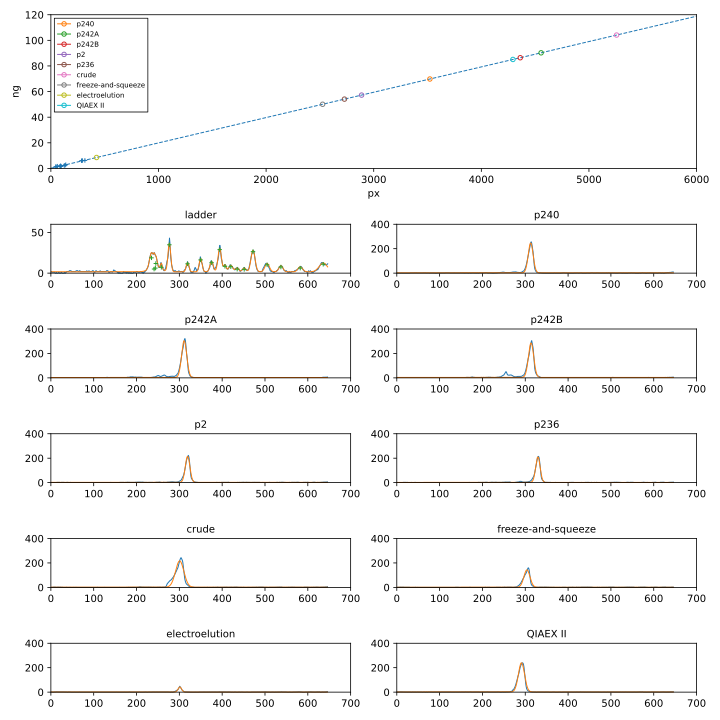

***********************************
Compare gel purification techniques
***********************************

Since I haven't been able to get electroelution to work (:expt:`189`), I want 
to try some alternative methods (while I wait for the commercial kit I just 
ordered to arrive).  

Methods
=======
- Freeze-and-squeeze [Tautz1983]_:

  - Run gel as normal:

    - Nearly linear inverse relationship between gel percentage and recovery, 
      so use the lowest possible concentration of agarose.

    - Also make the wells just large enough to hold the necessary volume, 
      because recovery is better with small gel slices.

  - Equilibrate gel slice in high-salt buffer.

    - Neutral pH and high-salt (300 mM NaAc) are relatively important.

  - Move gel slice to clean tube, and flash-freeze with liquid nitrogen or dry 
    ice.

  - Move gel into filter tube and immediately spin for 10m at 12,000g.

    - The filter is not necessary, but improves yields by 10-20%.
    - The authors make a filter using glass wool, but I'm planning to use a 
      Spin-X column.
    - Tha authors call for 12,000g, but I'm just going to do max speed (which I 
      think is something like 21,000g on our centrifuge).

  - Ethanol precipitation

    - Authors report that ethanol precipitation is quantitative even for very 
      low concentrations of DNA (for ≈2kb fragments).  They hypothesize that 
      this is due to trace agarose serving as a carrier.

    - I could probably also use a desalting column for this, but the columns I 
      currently have can only fit 2-12 µL of sample.  I'll probably have more 
      than that.

    - The other alternative is to use a spin-column.

- Spin-X:

  - Basically the same as the freeze-and-squeeze, but the protocol doesn't make 
    as much sense.

- Electroelute onto filter paper:

  - https://bitesizebio.com/66315/dna-gel-extraction-methods/

  - Make slice just downstream of band.

  - Insert piece of 3MM Whatman paper into the slice.

    - Can also insert 2 slices, if concerned that the DNA might run through the 
      one.

  - Continue electrophoresis for ≈2 min

  - Incubate filter paper with 50-100 µL EB.  The time and temperature for this 
    incubation aren't specified.

  - Centrifuge to elute DNA from filter paper.

  - The incubate and elution can be repeated to improve yield.

  - Ethanol precipitate or lyophilize to concentrate.

Results
=======

2022/09/01:

.. protocol:: 20220831_make_f186.pdf 20220831_make_f186.txt

.. figure:: 20220901_compare_purification_f186.svg

.. datatable:: 20220901_compare_purification_f186.xlsx

- The Nanodrop overestimated the concentration of my starting plasmid (p236) by 
  ≈17x.  I believe this is most likely due to RNA contamination.

  - According to my Nanodrop measurements, I got very poor recovery from my gel 
    purifications.

  - According to my densiometry analysis, I got very good recovery from the 
    same.

    - This accounts for the fact that I started with 5 µL of plasmid and 
      ultimately eluted in a volume of 10 µL, so I'd expect the concentration to 
      be halved even with 100% recovery.

      The analysis don't account for the fact that f186 is 2370 bp while p236 is 
      2437 bp.  If this were accounted for, it would slightly increase the amount 
      of f186 that was recovered relative to the amount of p236 that went into 
      the reaction, so these efficiency numbers may be slight underestimates.

    - The freeze-and-squeeze method has an apparent recovery just higher than 
      100%.  Even a recovery of 100% would not be possible, since I observed that 
      some fluorescent signal remained in the gel that didn't pass through the 
      Spin-X column.  I'm not sure what the source of the error is, though.

  - To better compare the two, I used the densiometry data to calculate the 
    absolute concentration of each sample (in ng/µL).

    - I used the ladder to construct a standard curve.

      - The 3.0, 2.0, and 1.5 kb bands are well-separated.
      - NEB publishes the relative quantity of each band in the ladder.
      - I loaded 25 ng of ladder: 10 µL at 2.5 ng/µL.
      - I loaded 1 µL of each of the other samples.

    - The standard curve seems to be a reasonably good fit:

      - The R² is good, although that doesn't mean much with only 3 points.
      - The line goes near the origin, as would be expected.

    .. figure:: fit_load_mass.svg

    .. datatable:: densiometry_vs_nanodrop.xlsx

    - The biggest discrepency is the concentration of the miniprepped plasmid 
      (p236).  The purified fragments have similar concentrations by both 
      techniques.

  - To check for RNA contamination, I remeasured the concentration of p236 
    using the Nanodrop:

    - Concentration: 173.3 ng/µL
    - 260/280 ratio: 2.03
    - 260/230 ratio: 2.32
    - 260 nm absorbance (10 mm path length): 3.465
    - 280 nm absorbance (10 mm path length): 1.711

  - The usual 260/280 ratios of DNA and RNA, respectively, are ≈1.8 and ≈2.0.  
    It's not impossible for DNA to have a ratio of ≈2.0, but this is definitely 
    consistent with RNA contamination.

  - The actual concentration of p236 in the miniprepped sample is 10 ng/µL.  
    That's a very low yield, especially since p236 is a pUC plasmid.  
    
  - I've been getting abnormally high yields from minipreps of my low-copy 
    plasmids for a while now.  I can't remember why, but I've been suspicious 
    for a while that the actual plasmid concentration of those preps is quite 
    low.  This is probably the same issue.

  - A possible explanation for all of these results is that the RNase in buffer 
    P1 has somehow been deactivated.  If the RNA from the lysed cells is not 
    removed, it could compete with the plasmid DNA for binding to the silica 
    column.  The column is supposed to have a capacity of 20 µg, and I've been 
    recovering closer to 10 µg (50 µL × 200 ng/µL).  However, since RNA is 
    single-stranded, it's not unreasonable that it might "take up more space" 
    in the column.

    My bottle of buffer P1 is dated June 2021, and I've kept it in the cold 
    room that whole time.  According to Qiagen, buffer P1 is stable for only 6 
    months when stored at 2-8°C (while the RNase A stock solution is stable to 
    2 years at room temperature).

    I'm going to try re-miniprepping p236, with old and fresh P1.

2022/09/02:

.. protocol:: 20220902_miniprep_from_plate.pdf 20220902_miniprep_from_plate.txt

.. figure:: 20220902_reminiprep_p236.svg

.. datatable:: densiometry_vs_nanodrop_preps.xlsx

- I think that both preps still have RNA contamination, but the prep with the 
  freshly-prepared buffer P1 has less.

  - Data consistent with RNA contamination:

    - Both preps have 260/280 ratios around 2 (1.98 and 2.03).

    - The Nanodrop measurements are >10x higher than the gel measurements.

  - Data consistent with the fresh P1 being less contaminated:

    - According to the gel, the old-P1 prep has 1.15x more DNA.

    - According to the Nanodrop, the old-P1 prep has 1.54x more DNA.

    - I think the discrepancy is due to RNA.

- Perhaps I need to incubate the cells for longer after adding P2, to give the 
  RNase more time to act.  I have enough cells left over to do a third 
  miniprep.  I'm going to try doing that with, with the fresh P1 and a 5 minute 
  incubation after adding P2.  It's not a perfect comparison, because the cells 
  sat in water for ≈4h, but it might be informative.

  Results: similar concentration and same 260/280 ratio (via Nanodrop) as 
  earlier minipreps.  Not going to run a gel, because I don't think it's going 
  to be informative.

2022/09/08:

Today, I did two experiments:

- I freshly miniprepped p236 and pUC19 backbone (p2) side-by-side, to see if 
  any differences in DNA/RNA yield can be attributed to my cloning.

- I did side-by-side comparisons of the gel purification methods form above, 
  plus the QIAEX II kit I just received.

.. protocol:: 20220908_compare_gel_purification_f186.txt

.. figure:: 20220908_compare_miniprep_gel_purification.svg

  This gel also include p240 and p242, which I was preparing to submit for 
  sequencing.

.. datatable:: 20220908_compare_miniprep.xlsx

.. datatable:: 20220908_compare_gel_purification.xlsx

- The RNA contamination problem isn't related to the sequence of my plasmid.  
  The pUC19 backbone plasmid (p2) looks just like my cloned plasmid (p236) by 
  both Nanodrop and densiometry.

- I probably should've run my own gel.  The E-gels aren't as good for being 
  quantitative, because they're pre-stained.

- How is the crude band brighter than the p236 band?  The crude reaction is 
  just p236 after a restriction digest.  It should be about 10% more dilute, 
  due to the volume of the buffer and enzymes.  I don't see how it could 
  possibly be twice as bright.

- The QIAEX II kit gave the best recovery.  The freeze-and-squeeze and 
  electroelution methods were not as efficient in this experiment as they 
  seemed to be previously.  I don't know if this is just variability, or if I 
  made some mistake.  I expect that the Qiagen kit will also be less sensitive 
  to things like the percentage of the gel, or the length of the DNA.  I also 
  didn't do the second elution, which could improve yield.

- The QIAEX II-purified DNA can be accurately quantified using the Nanodrop.

  This is in contrast to the Qiagen gel purification spin kits, which leave a 
  lot of guanidinium in the sample.  Here, though, the Nanodrop spectrum looks 
  very clean (data not shown).  The Nanodrop concentration also agrees pretty 
  well with the densiometry concentration.

- I might have overestimated recovery slightly, because the crude reaction has 
  a shoulder that the purified reactions don't.
  
Conclusions
===========
- I think I just have to conclude that my minipreps have a lot of RNA in them.
  
- I could try using the Qubit to confirm that my gel quantification is 
  accurate.  If I really care, I could measure RNA and DNA with the Qubit, to 
  really nail down what's going on.  Not sure it's worth it, though.

- I could also double check my gel-quantification by running 2-3 dilutions of 
  each plasmid prep.  The idea would be to get a dilution that is within the 
  range encompasses by the ladder, so I don't need to extrapolate outside of 
  the standard curve.  That said, I'm not extrapolating very far outside the 
  curve as it is, and I've never gotten the impression that pixel intensities 
  in gel images are non-linear.

- I'll use the QIAEX II gel purification kit going forward.
