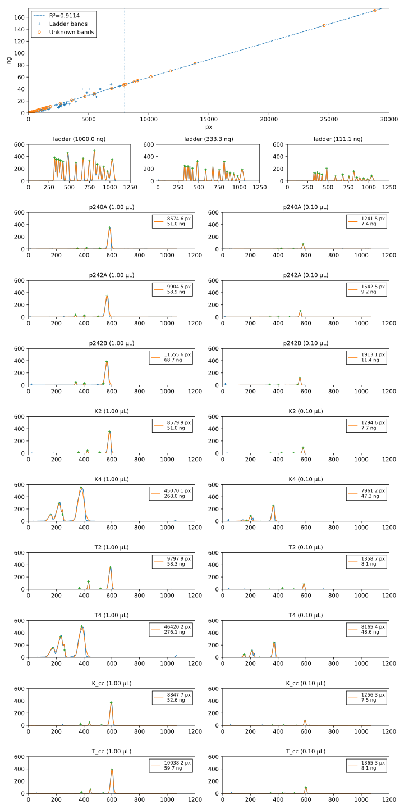

***************
Check for DNase
***************

I had the thought that there might be DNase contamination, so I decided to 
re-measure the concentration of the plasmids I miniprepped in :expt:`193` and 
:expt:`195`, both of which had been sitting on my bench at room temperature 
since I collected them.

The gel also contains minipreps of p240 and p242, for which I included extra 
RNase and the optional PB wash step.  Not a rigorous experiment, because my 
goal was just to make plasmid and not to make with/without comparisons, but 
maybe informative anyways.

.. protocol:: 20220920_miniprep_p240_p242.pdf

.. datatable:: 20220920_check_for_dnase_report.xlsx

- The gel densiometry measurements agree quite well with the Qubit 
  measurements.

- There is some RNA contamination, but it's doesn't account for most of the 
  Nanodrop signal.

  - I added extra RNase to the miniprep this time, so it may be that these 
    preps had less RNA contamination than usual.

  - There's still 150-300 ng/µL of unaccounted for Nanodrop signal.

    - I think it was the 9/8 gel from :expt:`190` that showed a bright, 
      fast-running band in my miniprepped DNA.  (This band isn't visible in the 
      image, because it ran off the end, but I saw it during the run.  If it's 
      not dsDNA or RNA, it most likely is either nucleotides or ssDNA.  Where 
      could such contaminants be coming from, though?

    - [Hengen1996]_ describes that this band could be "double-stranded, cyclic, 
      coiled DNA composed of two intertwined, but permanently denatured, 
      single-strands of plasmid DNA".  If so, this band would be susceptible to 
      T5 exonuclease treatment (which the plasmid itself would not be) and 
      would be a consequence of the alkaline lysis step.  It may be the case 
      that smaller plasmids are more likely to denature in this way, which 
      could be why Tina's 1124 plasmid seems easier to purify.

- The samples from :expt:`195` are slightly more dilute now (50-80 ng/µL) than 
  yesterday (90-100 ng/µL).  I not sure if this is significant, though.

- The pUC19 samples from :expt:`193` are about as concentrated now (50-80 
  ng/µL) as they were previously (70-80 ng/µL).

- The p1124 samples from :expt:`193` are more dilute now (470-480 ng/µL) than 
  they were previously (outside of dynamic range, but >700 ng/µL).

  - Note that the fits for the p1124 samples aren't perfect, but I didn't 
    bother optimizing them because it wouldn't appreciably change the results.  
    Also, the bands are a bit smeared, so the whole idea of fitting them to 
    Gaussians is a bit flawed.

  - The 1 µL loads are still well outside the linear range, but this time the 
    10x dilutions are well within it.
