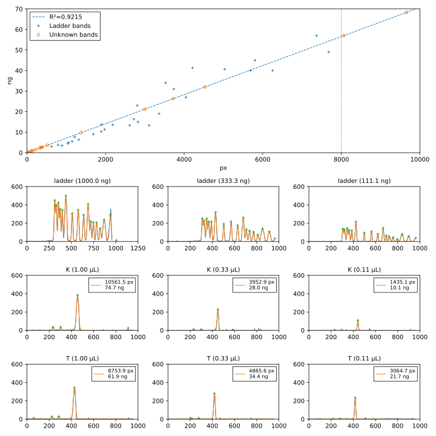

***********************
Compare competent cells
***********************

I transformed my plasmid with Tina's competent cells, which are MACH1 cells 
that she ordered directly from Thermo.  My competent cells are MACH1 cells that 
I prepared myself using the Mix-n-go kit from Zymo.

.. datatable:: 20220917_compare_comp_cells_report.xlsx

- The competent cells don't make a big difference.

- The peak areas for the sample with Tina's competent cells are not really 
  consistent with each other.  I don't know why.
