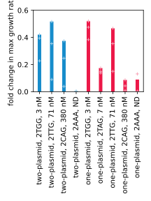

**********************
Measure standard curve
**********************

My ultimate goal is to develop a high-throughput assay that will give me 
accurate measurement of protein binding to DNA.  In order to know how accurate 
such an assay is, I'll need to measure standard curves.  My goal for this 
experiment is to measure standard curves for all of the different assay 
variants I have in mind (e.g. different reporters, different plasmid 
refactorings, etc.) and compare which gives the largest and most linear dynamic 
range.

Considerations
==============

Published data
--------------
I'd rather build my standard curve from existing binding data, rather than 
having to collect my own.  These references vary both the target site and the 
protein itself.  I'd probably prefer to vary just the target site, because that 
would be easier and cheaper to clone, but in the long run I'll probably want to 
do both:

- [Jamieson1994]_

  .. datatable:: jamieson1994_zif268.xlsx

  - :math:`K_D` measured by gel shift.
  - These data were used by [Jamieson1996]_ for calibration, which is basically 
    what I want to do as well.

- [Wu1995]_, [Yang1995]_

  .. datatable:: wu1995_zif268.xlsx

  - :math:`K_D` measured by SPR.  To my knowledge, this is the most accurate 
    way to measure :math:`K_D` [Matos2010]_ [Yang2016]_.
  - Table 2 in [Wu1995]_ includes all the data from [Yang1995]_
  - Wildtype measured with 4 different targets, but all 3 non-WT targets have 
    similar :math:`K_D`.

- [ElrodErickson1999]_

  .. datatable:: elroderickson1999_zif268.xlsx

  - :math:`K_D` measured by gel shift.
  - Measuring :math:`K_D` is the focus of the paper.
  - Alanine mutant of base-contacting residues.
  - Only 3 target sites, but they span a good range.
  - Has references to 7 other papers that measured :math:`K_D` for Zif268, and 
    claims that the measurements for wiltype protein/target range from 0.01-6.5 
    nM (depending on the specific conditions).

- [Bulyk2001]_

  .. datatable:: bulyk2001_zif268.xlsx

  - :math:`K_D` measured by phage ELISA.
  - I probably trust these data less than the gel shift data from 
    [Jamieson1994]_, since in this experiment the Zif268 is still tethered to 
    phage.
  - But these data also span a much larger range.

Which target sites to use?

- Kinda want a geometrically increasing series of binding constants, e.g. 1 nM, 
  2 nM, 4 nM, 8 nM, 16 nM, etc.

- ``gcg tgg GAG``:
    
  - Measured by [ElrodErickson1999]_ (gel shift) and [Jamieson1994]_ (gel 
    shift).  Somewhat different :math:`K_D` relative to wildtype (3x vs 10x), 
    but in both cases this is very nearly the second best target.  So this 
    sequence is probably a good test of an assay's ability to distinguish 
    between two pretty similar binders.

- ``gcg tgg GCC``:
  
  - Measured by [ElrodErickson1999]_ and [Jamieson1994]_, but they disagree 
    significantly about how well it binds.

- ``gcg TTG gcg``:

  - Measured by [Wu1995]_ (SPR, 83.7 nM, 13x worse than WT) and [Bulyk2001]_ 
    (EMSA, 71 nM, 23x worse than WT).  Here the agreement is quite good.  That 
    makes me more inclined to trust the other [Bulyk2001]_ numbers, even though 
    they're measured while still bound to phage.

- No other targets were measured by multiple references (that I found).

- Based on what I have so far, I'm inclined to use:

  - ``gcg TGG gcg``: :math:`K_D` = 3.0 nM
  - ``gcg TAG gcg``: :math:`K_D` = 6.7 nM
  - ``gcg TTG gcg``: :math:`K_D` = 71 nM
  - ``gcg CAG gcg``: :math:`K_D` = 380 nM

  - These are all from the [Bulyk2001]_ EMSA measurements.  ``TTG`` is also 
    measured in [Wu1995]_.
  - I'm more inclined to trust [Bulyk2001]_ because the one measurement that 
    overlaps with the SPR data has good agreement.
  - 

- Which protein variants to use?

  - [Wu1995]_, which I think is the highest quality :math:`K_D` data, has a 
    handful of variants with a good range of activities:

    - WT
    - C7
    - C9
    - C10
    - F8
    - F15

    - I could use these variants with both the wildtype ``gcg tgg gcg`` target 
      site and the ``gcg tgg TGT`` site.

Cloning
=======
2022/05/04:

I've been struggling to make p210-212.  The basic protocol is:

- Restriction digest
- Spin cleanup
- Ligate insert

I'm suspicious that I'm losing most of my backbone at the spin cleanup step:

- When I've nanodropped the product after the spin cleanup, I've gotten very 
  low yields.
- When I accidentally forgot to do the spin cleanup (for p225-228 on 
  2022/05/02), I got thousands of colonies.

Since I can't nanodrop the unpurified restriction digest, I ran a gel to see 
the relative concentration of DNA before and after the cleanup step:

.. protocol:: 20220504_make.txt

.. figure:: 20220504_check_f168.svg

- The +cleanup DNA is ≈44x more dilute than the −cleanup DNA.  Since both are 
  in the same volume, that means I lost a lot of material during the cleanup.

- I used the laser scanner because the +cleanup band wasn't visible when using 
  the transilluminator.

Something is wrong with the spin columns.  My options:

- Order new ones.
- Ask about beads.
  
2022/05/09:

I navigated through Qiagen's automated technical support form today, and I 
realized that the MinElute columns are only advertised as being able to purify 
fragments up to 4 kb.  From the "Product details" page found here__:

  Using a microcentrifuge or vacuum manifold, high concentration of DNA 
  fragment (70 bp – 4 kb) is quickly achieved. (DNA fragments larger than 4 kb 
  should be purified using the QIAquick PCR Purification Kit.)

__ https://www.qiagen.com/us/products/discovery-and-translational-research/dna-rna-purification/dna-purification/dna-clean-up/minelute-pcr-purification-kit/

So I think the solution is to order the standard PCR purification kit.

2022/05/16:

I repeated the purification with the QIAquick PCR purification kit.  Again I 
couldn't detect any DNA by Nanodrop after the purification.  At the same time, 
I confirmed that the input DNA (p168) had a concentration of ≈335 ng/µL by 
Nanodrop.  So I ran another gel.  Based on the measured concentration of p168, 
every lane below should have 100 ng DNA:

.. figure:: 20220516_check_p211_cleanup.svg

- The bands were barely visible with the transilluminator, so I used the laser 
  scanner.
- This time, it seems like the purification worked well, but the input DNA 
  concentration was low.  I can't understand how this information is compatible 
  with the high Nanodrop measurements.  If there was contamination with genomic 
  DNA, that would show up on the gel (unless so small that it ran all the way 
  off the bottom of the gel).

Something is wrong, but I don't know what...
Results
=======
2022/06/06:

.. protocol:: 20220523_measure_standard_curve.txt

Observations:

- I decided to try leaving out mineral oil, and that was a mistake.  The wells 
  had almost completely evaporated by the end of the run.  So I shouldn't read 
  too much into these data.

- The data are very noisy, but the broad trends are right:

  - 2TGG gives the best growth and 2AA gives the worst.
  - Growth in His+Ura media is about equal for all strains.

- I think the noise is due to the fact that the different dilutions hit max 
  growth at different times, and are therefore strongly effected by the high 
  rate of evaporation.

- Overall, the data don't seem very linear, but I need to repeat.

Results
=======
2022/06/04:

- I did this experiment without using a lid or mineral oil, in the hope that 
  the moat would be enough to prevent evaporation.  It wasn't, and the well 
  were nearly dry when I took the plate out of the plate reader.  For that 
  reason, I'm not going to interpret the results from this experiment.

2022/06/23:

.. protocol:: 20220623_measure_standard_curve.pdf 20220623_make_nm_stock.txt 20220623_measure_standard_curve.txt 20220623_dilute_strains.txt

2022/07/05:

.. protocol:: 20220623_measure_standard_curve.pdf
  
   I followed the same protocol as from 2022/06/23, except that this time I 
   also had managed to clone s36.

2022/07/13:

I analyzed the 6/23 and 7/5 data together, to get a better sense for the 
variability between biological replicates:

- The consistency seems pretty good between experiments.

- The concentration of 3-AT used in these experiments (10 mM) does not seem to 
  be enough to differentiate between the strongest binders and the weakest 
  binders.  This is not what I expected from the results in Fig S5 of 
  [Noyes2008]_, where a 20x difference in :math:`K_D` is enough to see a stark 
  difference in growth.

  Some reasonable follow-up experiments:

  - Use the same target sites as [Noyes2008]_.
  - Try more 3-AT concentrations.

- It will be interesting to compare this result to the qPCR assay, perhaps even 
  with the same strains.
