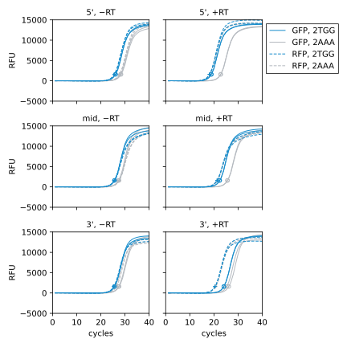
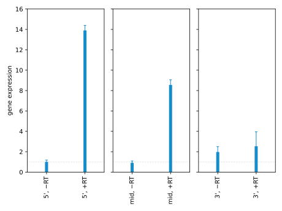

*****************
Compare amplicons
*****************
The amplicons I used in :expt:`154` are at the 5' end of the mRNA.  It's 
possible that amplicons further to the 3' end could give better results, e.g.  
if the 5' end gets degraded or transcription sometimes starts after the forward 
primer.  Towards that end, I want to design primers for various points along 
the mRNA and compare the results from each.

.. protocol:: 20220719_compare_amplicons.pdf 20220622_compare_amplicons.txt 20220719_compare_amplicons.txt

- Some of the melt curves for this experiment looked bad, but I haven't 
  carefully analyzed them yet.  Until I do that, it's possible that everything 
  I'm seeing could just be a consequence of the primers not being very good.

  That said, I saw in :expt:`167` that all six primer pairs amplify cleanly at 
  61°C.  I used that temperature for this experiment to be consistent with what 
  I've done in the past, but it's worth noting that the optimal :math:`T_a` 
  (especially for the "mid" primers) is lower than that.  I'd have to measure 
  standard curves for the mid- and 3'-primers to know if they give linear 
  signal at this temperature, though.

- The 5' primers seem to give significantly better dynamic range than the 
  others.  This is consistent with the mRNA being degraded from the 3' end, 
  although I'm not necessarily claiming that that's what's happening.

  If I wanted to be more sure about this conclusion, I could:

  - Measure standard curves for the primers in question.
  - Test more primers along the length of the gene, to see if the linear 
    relationship amplicon position and gene expression holds.

  I may or may not do any of that, but I probably will be more skeptical about 
  plans to express barcodes from very short amplicons.

- The idea that the mRNA is being degraded from the 3' end is contrary to the 
  result from [Selinger2003]_, which claims that bacterial mRNA is usually 
  degraded from the 5' end.  However, this could be easily be due to 
  differences in the sequence of natural mRNAs vs my designed mRNA.

  [Rauhut1999]_ explains that bacteria have no known 5'→3' exonucleases, so 
  apparent 5'→3' degradation is most likely to to endonuclease activity (most 
  prominently RNase E) followed by 3'→5' exonuclease activity.  This is 
  affected by the presence of (i) RNase E target sites and (ii) hairpins that 
  prevent 3'→5' exonuclease activity.  My mRNAs don't have anything on the 3' 
  end to prevent nuclease activity, so it's plausible that 3'→5' exonuclease 
  activity is just the fastest process for them.

  Adding a sequence that inhibits 3'→5' degradation would increase the total 
  amount of mRNA in the system, which could maybe improve the signal to noise 
  ratio.

  .. update:: 2022/07/25

    Having read a bit more about this, it seems that the 3' hairpin from the 
    terminator should serve to inhibit 3'→5' exonucleases.  So I'm skeptical 
    that adding more hairpins would have much effect.

- I used Luna instead of SsoAdvanced for this experiment, because BioRad is 
  taking forever to ship SsoAdvanced.  So despite the caveat about not having 
  standard curve for the mid- and 3'-primers, even the standard curves for 
  s1/s2 and s3/s5 may not apply.

