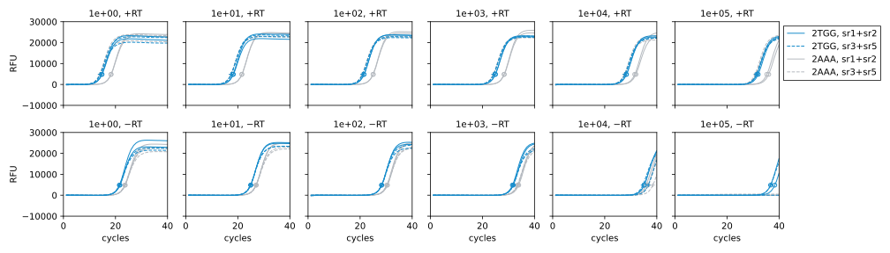
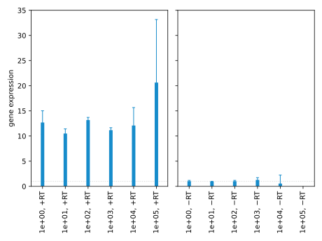

**********************
Compare cDNA dilutions
**********************

One reason why I might be seeing strong background signal in :expt:`154` is 
that I'm not diluting the cDNA enough.  In this experiment, I want to measure 
gene expression for a series of cDNA dilutions, to see which gives the best 
signal-to-noise ratio.

.. protocol:: 20220622_compare_dilutions.pdf 20220622_serial_dilution_pcr_pcr.txt

Observations:

- Diluting the template doesn't have a strong effect on the dynamic range, but 
  does have a noticeable affect on the consistency of the results (i.e. the 
  standard deviation).

- The 100x dilution seems to give the best results.  It also gives :math:`C_q` 
  values near 20, which is generally about what you hope for.  The 10x and 
  1000x dilutions also give good results, though.

- A 100x dilution may not be ideal for other RT protocols, but I can probably 
  do well enough just by aiming for :math:`C_q` values around 20.

- I don't know why the 2AAA strain has less signal in the −RT conditions.  
  Perhaps I did a better job with that RNA miniprep, somehow?  I'll be 
  interested to see if this is a consistent feature of these experiments.
