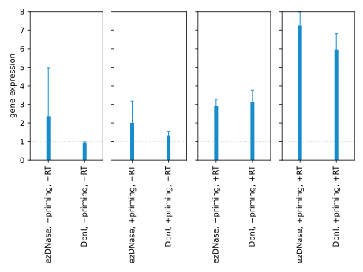
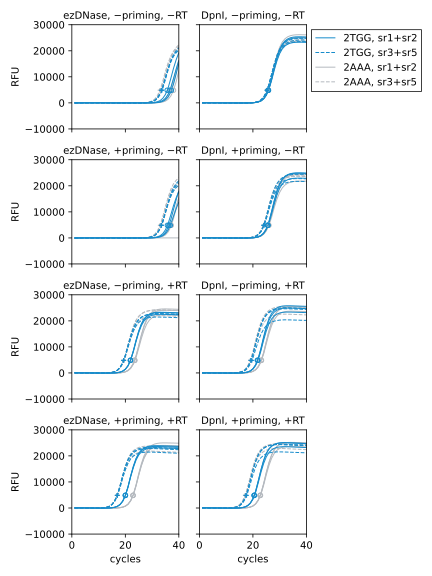

************
Compare DpnI
************

Erik suggested using DpnI to specifically digest plasmid DNA, but not reverse 
transcribed DNA.  This seems like a good idea to me.  Some thoughts:

- Neither of my qPCR amplicons naturally include any DpnI sites, so I need to 
  install them myself.

- It possible that not every DpnI site will be methylated.  A cursory search 
  makes it seems like most sites will be, though [Barras1989]_.

Roadmap
=======
- Clone p232-p235
- Do experiment.

Plans
=====
Should I keep the ezDNase treatment?

- That will complicate things a bit, because I don't know that DpnI and ezDNase 
  have compatible buffers.  I don't even know what ezDNase is!

- ezDNase is expensive, so if it turns out that I don't need it, that would be 
  good to know.

Results
=======
.. protocol:: 20220822_compare_dpni.pdf 20220822_compare_dpni.txt

- ezDNase seems to be more effective than DpnI at removing plasmid DNA.

  - Specifically, the −RT conditions have significantly more signal in the DpnI 
    reactions than in the ezDNase reactions.

- There isn't a big difference in the final gene expression values for the two 
  DNase treatments, although I normally get ≈2x better signal with ezDNase.

- The reactions with RT primers that are complementary to the RNA (+priming) 
  have slightly more signal than those with non-complementary primers 
  (−priming).  The reactions with the non-complementary primers should look 
  like the −RT control, though.  Perhaps this means that the RT is synthesizing 
  DNA from the DNA template.

Conclusions
===========
Using DpnI to digest plasmid DNA doesn't seem to be a promising approach.
