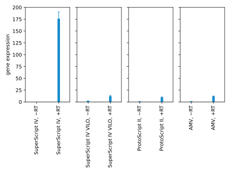
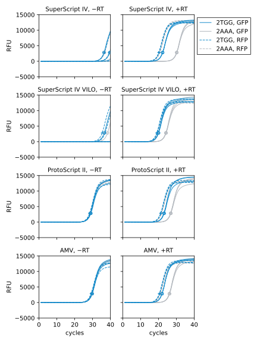
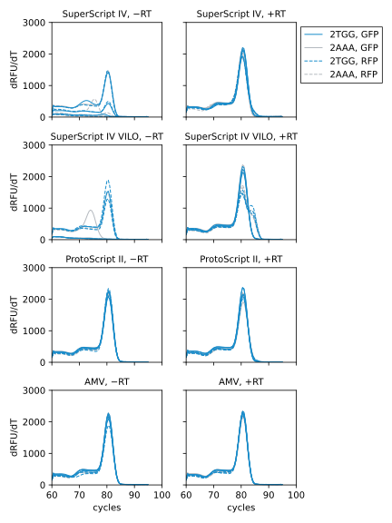
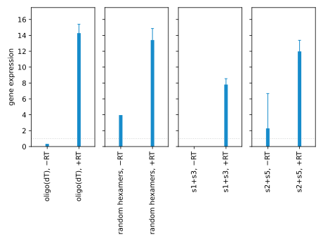
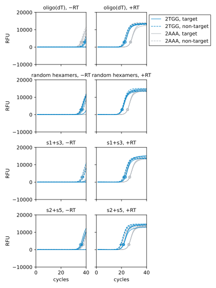
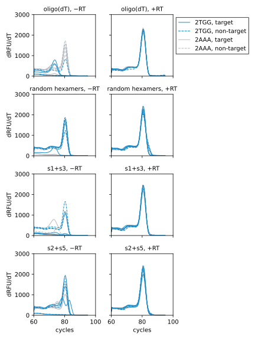

***************************
Compare enzymes and primers
***************************

I've been using an RT master mix that include random hexamer/oligo-dT primers.  
Since I know specifically which gene I want to reverse transcribe, I might be 
able to get better signal by using a specific primer (as [Boldridge2020]_ 
does).

I've also realized that many different vendors sell RT enzymes.  I want to try 
a couple to see if there's any difference.

Which enzymes?
==============
Some articles on the differences between reverse transcriptase enzymes:

- https://www.thermofisher.com/us/en/home/life-science/cloning/cloning-learning-center/invitrogen-school-of-molecular-biology/rt-education/reverse-transcriptase-attributes.html
- https://www.promega.com/resources/pubhub/choosing-the-right-reverse-transcriptase/
- https://www.promegaconnections.com/choosing-the-right-reverse-transcriptase-for-your-project/

RT taxonomy:

- Engineered MMLV

  - Compared to wildtype MMLV:

    - Higher processivity
    - Higher incubation temperature 
    - Lower RNase H activity

- Wildtype MMLV

- Engineered AMV

- Wildtype AMV

  - Compared to MMLV:

    - A complex rather than a monomer, which makes engineering more difficult.
    - Higher natural incubation temperature, but not compared to engineered 
      versions.
    - Higher RNase H activity.
    - Higher error rate.

Some miscellaneous considerations:

- With gene-specific primer, higher RT temperatures can lead to higher 
  specificity.

- Are there RTs that are specifically for RNAseq?

- [Boldridge2020]_ used Superscript IV with custom primers.  I can't find the 
  sequences of those primers, though.

Vendors:

- NEB
- Thermo
- Takara
- Promega
- Sigma

Final picks:

- SuperScript IV first strand

  - Same as [Boldridge2020]_
  - Allow custom primer
  - $10.61/rxn

- Superscript IV VILO

  - Optimized for quantitative transcription.
  - May be more consistent than non-master-mixes.
  - $14.16/rxn

- ProtoScript II

  - I like NEB.
  - Cheaper than SuperScript, and might be just as good.
  - $3.76/rxn

- AMV

  - Worth trying a non-MMLV enzyme.
  - RNase-H activity might help give quantitative transcription.
  - $3.04/rxn

Which primers?
==============
- I think I can design RT primers in the same way as PCR primers.  After all, 
  PCR primers are used for RT in one-step qPCR reactions.

- In the same vein, I can just use sr2 and sr5 as my RT primers.  In fact, I 
  can probably then just leave those primers out of the PCR reaction.

Results
=======
2022/07/20:

.. protocol:: 20220720_compare_enzymes.pdf 20220720_compare_enzymes.txt

- The à la carte SuperScript reaction gives a 175x dynamic range.  The other 
  RTs all give ≈10x dynamic ranges, which is comparable with what I've seen 
  previously.

  I expect that the only significant difference between the SuperScript and 
  SuperScript VILO reactions is the primer.  So I'd be curious to do a 
  head-to-head comparison of random hexamers, oligo-dT, and sense-oligos with 
  SuperScript IV.  I might include a non-sense control, too.  The primer isn't 
  the whole story, though, because ProtoScript and AMV used the same primers 
  and didn't have >100x dynamic ranges.

  I'm not sure I totally trust this result yet.

- The two SuperScript reactions have significantly less background signal than 
  the other RTs.  This is probably because they include an extra DNase step.  
  However, that step seems to be helpful, so I don't see any reason to not 
  include it going forward.

- The melt curves for the RFP reaction with SuperScript IV VILO have a clear 
  shoulder.  I don't know what this is, and why it didn't show up in any of the 
  other conditions.

  The melt curves for the −RT SuperScript IV reactions look really messy, but I 
  think that's just because a lot of those reactions never amplified (which is 
  a good thing).

2022/07/27:

.. protocol:: 20220726_compare_primers.pdf 20220726_compare_primers.txt

- The same reaction that gave 175x dynamic range in the previous experiment 
  (s2+s5, +RT) gave only 12x in this one.  The difference is the amount of 2AAA 
  RNA that's detected.

  Here is every difference between these two experiments that I can think of:

  - The cells were slightly more dense in this experiment than they were in the 
    previous one:

    .. datatable:: strain_densities.xlsx

    That said, the difference is much more substantial for the 2TGG strain 
    (sz224) than the 2AAA strain (sz228).  So this may not something that can 
    explain the difference in dynamic range, but it could be reasonable to try a 
    few different growth times.

  - When purifying total RNA, I used 600 µL RNA lysis buffer in this experiment 
    as opposed to 300 µL in the previous one.
  
  - I didn't make quite enough DNase-treated RNA, so I had to dilute it with 
    1/10x volume water.

  - I used nuclease-free water instead of DEPC-treated water when preparing the 
    s1+s3 and s2+s5 primer mixes.

  It's hard to believe that any of these differences could explain the 15x 
  difference in dynamic range.

  I think I still have the original RNA from both of these experiments.  So I 
  could try repeating the RT steps with that, and seeing if the difference is 
  in the RNA or not...

- The s1+s3 reaction has much more signal than I expected.  There shouldn't be 
  any signal, because s1 and s3 are not complementary to the mRNA.  One 
  explanation is that s1 and s3 were priming "reverse transcription" directly 
  from the plasmid DNA, which is double stranded and therefore complementary to 
  both primers.  That doesn't explain the difference between the 2TGG and 2AAA 
  target sites, though.  The only other explanation I can think of is that I 
  make a pipetting mistake.
