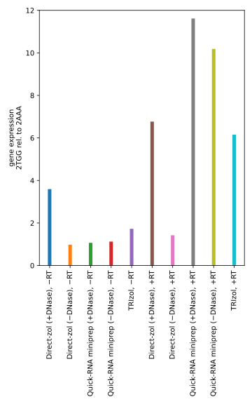

*******************
Compare extractions
*******************
In :expt:`154`, I saw only a 4x difference in gene expression between target 
and non-target sites.  This could be due to DNA contamination, as I've seen 
some people online claiming that TRIzol extractions recover a relatively large 
amount of DNA.

The way to deal with DNA contamination is to treat with DNase.  There seem to 
be three ways to do this:

- Extract, precipitate, digest, then precipitate again.  

- Extract, spin column, e.g. Zymo Direct-Zol

- Spin column, e.g. Zymo Quick-RNA

I don't like doing precipitations, so I'd rather avoid doing that if possible.  
One advantage of avoiding the extraction altogether is that I'd eliminate the 
possibility of phenol contamination, although I think I can solve that problem 
by doing extra chloroform washes.  It's also just a pain to have to do 
everything in the hood.  Presumably the advantage of doing the extraction is 
that it is the most effective way to eliminate RNase activity, and so gives the 
highest yield.

Overall, I think ease-of-use is more important than yield, so I'm inclined to 
try an RNA miniprep kit.

Results
=======
.. protocol:: 20220602_compare_rna_purification.txt 20220603_compare_rna_purification.txt

:math:`C_q` measurements::

                                                      n  n_nan    cq_mean  cq_median     cq_min     cq_max    cq_std
  primers target rt    extraction
  sr1,sr2 2AAA   False Direct-zol (+DNase)          2.0    0.0  22.821682  22.821682  22.744125  22.899240  0.109683
                       Direct-zol (−DNase)          2.0    0.0  14.029558  14.029558  13.998387  14.060729  0.044082
                       Quick-RNA miniprep (+DNase)  2.0    0.0  22.650311  22.650311  22.623538  22.677084  0.037862
                       Quick-RNA miniprep (−DNase)  2.0    0.0  22.522316  22.522316  22.487786  22.556846  0.048833
                       TRIzol                       2.0    0.0  19.438832  19.438832  19.354426  19.523239  0.119369
                 True  Direct-zol (+DNase)          2.0    0.0  16.890470  16.890470  16.889632  16.891309  0.001186
                       Direct-zol (−DNase)          2.0    0.0  13.359613  13.359613  13.350738  13.368488  0.012551
                       Quick-RNA miniprep (+DNase)  2.0    0.0  18.589540  18.589540  18.579010  18.600070  0.014892
                       Quick-RNA miniprep (−DNase)  2.0    0.0  18.369631  18.369631  18.360778  18.378484  0.012520
                       TRIzol                       2.0    0.0  17.364963  17.364963  17.363220  17.366707  0.002466
          2TGG   False Direct-zol (+DNase)          2.0    0.0  20.661749  20.661749  20.625934  20.697564  0.050650
                       Direct-zol (−DNase)          2.0    0.0  13.925895  13.925895  13.833635  14.018155  0.130475
                       Quick-RNA miniprep (+DNase)  2.0    0.0  22.499671  22.499671  22.406832  22.592510  0.131294
                       Quick-RNA miniprep (−DNase)  2.0    0.0  21.651408  21.651408  21.632729  21.670088  0.026416
                       TRIzol                       2.0    0.0  19.071421  19.071421  19.042507  19.100335  0.040891
                 True  Direct-zol (+DNase)          2.0    0.0  14.030264  14.030264  14.010933  14.049595  0.027338
                       Direct-zol (−DNase)          2.0    0.0  12.686924  12.686924  12.661742  12.712105  0.035612
                       Quick-RNA miniprep (+DNase)  2.0    0.0  15.363792  15.363792  15.347096  15.380489  0.023612
                       Quick-RNA miniprep (−DNase)  2.0    0.0  14.663532  14.663532  14.659744  14.667320  0.005357
                       TRIzol                       2.0    0.0  14.743003  14.743003  14.729947  14.756059  0.018464
  sr3,sr5 2AAA   False Direct-zol (+DNase)          2.0    0.0  19.858276  19.858276  19.842078  19.874475  0.022908
                       Direct-zol (−DNase)          2.0    0.0  13.931861  13.931861  13.917807  13.945916  0.019876
                       Quick-RNA miniprep (+DNase)  2.0    0.0  22.380979  22.380979  22.376098  22.385859  0.006902
                       Quick-RNA miniprep (−DNase)  2.0    0.0  21.890705  21.890705  21.860734  21.920676  0.042386
                       TRIzol                       2.0    0.0  18.475522  18.475522  18.421398  18.529646  0.076543
                 True  Direct-zol (+DNase)          2.0    0.0  12.177955  12.177955  12.097807  12.258104  0.113347
                       Direct-zol (−DNase)          2.0    0.0  11.663473  11.663473  11.592914  11.734031  0.099785
                       Quick-RNA miniprep (+DNase)  2.0    0.0  14.418492  14.418492  14.405314  14.431670  0.018636
                       Quick-RNA miniprep (−DNase)  2.0    0.0  14.202919  14.202919  14.154023  14.251814  0.069149
                       TRIzol                       2.0    0.0  13.519179  13.519179  13.498315  13.540042  0.029506
          2TGG   False Direct-zol (+DNase)          2.0    0.0  19.542620  19.542620  19.516330  19.568911  0.037180
                       Direct-zol (−DNase)          2.0    0.0  13.799352  13.799352  13.766404  13.832300  0.046596
                       Quick-RNA miniprep (+DNase)  2.0    0.0  22.325620  22.325620  22.288984  22.362257  0.051812
                       Quick-RNA miniprep (−DNase)  2.0    0.0  21.189708  21.189708  21.178832  21.200585  0.015382
                       TRIzol                       2.0    0.0  18.896490  18.896490  18.883029  18.909950  0.019036
                 True  Direct-zol (+DNase)          2.0    0.0  12.076402  12.076402  11.979189  12.173614  0.137479
                       Direct-zol (−DNase)          2.0    0.0  11.499917  11.499917  11.450827  11.549007  0.069424
                       Quick-RNA miniprep (+DNase)  2.0    0.0  14.730733  14.730733  14.707920  14.753547  0.032263
                       Quick-RNA miniprep (−DNase)  2.0    0.0  13.845348  13.845348  13.828061  13.862636  0.024448
                       TRIzol                       2.0    0.0  13.518801  
                       13.518801  13.459024  13.578578  0.084537

Observations:

- The Quick-RNA miniprep kit seems to give the best results, with or without 
  DNase treatment.  Since it's also the most convenient, I'll use it going 
  forward.

- My analysis script is not good yet.  I find it more helpful to just look at 
  the table of |Cq| values...

- I have too much template in my reactions.

  - My constitutive controls (sr3,sr5) have |Cq| ≈ 11–14, which is very low.  
    The corresponding −RT controls have |Cq| ≈ 19-22, which is significantly 
    higher, but still very low.

