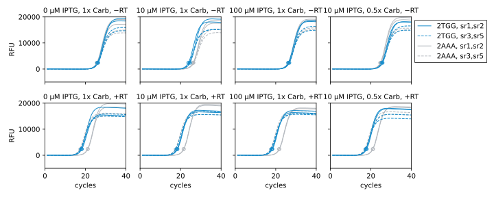
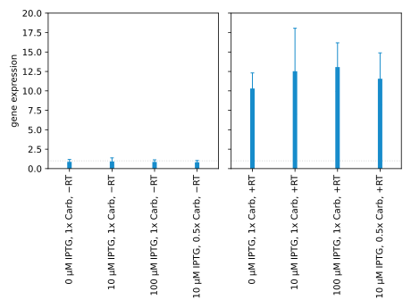

*************
Compare media
*************

[Noyes2008]_ calls for media with 10 µM IPTG and 0.5x antibiotic.  Here I want 
to test the importance of these parameters.  The IPTG concentration is very 
low: usually IPTG concentrations are in the mM range.  The antibiotic 
concentration makes sense, because the plasmid with the resistance gene is very 
low-copy.

.. protocol:: 20220622_compare_media.pdf 20220622_compare_media.txt

- The :math:`C_q` values are in a good range in this experiment; I think the 
  10x dilution was a good idea.

- Adding IPTG seems to have a slight affect on dynamic range.  Perhaps I could 
  do another experiment with much higher concentrations, but for now I don't 
  see any reason to stop using 10 µM IPTG.

- The carbenicillin concentration does not have a significant effect.  I'll 
  keep using 1x, because (i) it's easier and (ii) it can't be bad to have more 
  stringent selection.
