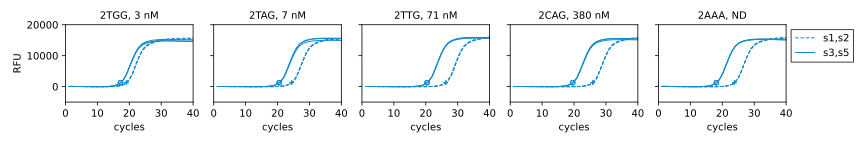

**********************
Measure standard curve
**********************

So far, the best version of the qPCR protocol that I've found is the one 
described in :expt:`172`, with a dynamic range of ≈175x.  Here, I want to see 
if that dynamic range corresponds to a good ability to distinguish between 
target sites with different binding affinities.

Cloning
=======
2022/07/25:

.. protocol:: 20220725_make.txt

Got no yield after cleanup column, despite having 132 ng/µL before column.  Run 
E-gel to what happened:

.. figure:: 20220725_make_f182.svg

  p2 is pUC19, which I included as a positive control.  By NanoDrop, it should 
  be 230 ng/µL (similar to p224, which is 275 ng/µL).

.. datatable:: 20220725_make_f182.xlsx

- p224 has a high-MW smear.  If the smear is contaminating genomic DNA, that 
  could be part of why the NanoDrop reading is so high, but even with the smear 
  there is significantly less signal in the p224 lane than the p2 lane.

- f182 is very dilute, but appears to be clean and exactly the right size.  
  This probably means that the digestion and cleanup steps worked.  
  Furthermore, because the intensities of the p224 and f182 lanes are 
  comparable, the smear is probably mostly plasmid DNA, perhaps with different 
  amounts of supercoiling.

- If I take the p2 concentration of 230 ng/µL as true, p224 is 10 ng/µL and 
  f182 is 1 ng/µL.  If I accept that concentration, I get close to the minimum 
  recommended amount of DNA: 14 fmol rather than 20 fmol.  I'm going to go with 
  that and see if it works.

  1 ng is the published detection limit for E-Gel EX.  I loaded 1 µL of each 
  sample, and the f182 band definitely seems close to the detection limit, so 
  this is corroborates the densiometry results a bit.

Results
=======
.. protocol:: 20220729_measure_standard_curve.pdf 20220729_measure_standard_curve.txt

- Although this is just one biological replicate, there seems to be a clear 
  correlation between :math:`K_D` and gene expression.  At the same time, 
  though, it seems like it'll be hard to detect binders weaker than ≈10 nM.  

  In contrast, the growth assay (:expt:`159`) doesn't seem to have a strong 
  correlation between :math:`K_D` and fitness, but (in principle) I can tune 
  the "survival cutoff" by increasing the 3-AT concentration.

- The expression of the 2AAA RNA is slightly higher than the 2TTG and 2CAG 
  RNAs.  This is very different than what I've seen in the growth assay, where 
  2AAA is the only target that doesn't grow at all.  This is also inconsistent 
  with the :math:`K_D` values.  Given the results of the growth assay, I don't 
  think this could be explained by leaky expression.  My guess is that it's 
  related to the RT reaction, e.g. unintended transcription of undigested 
  plasmid.
