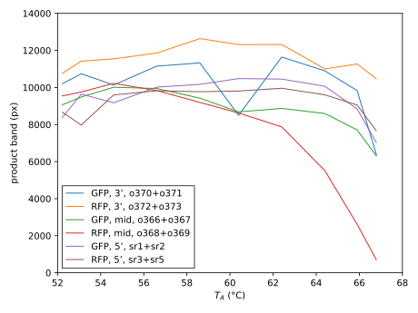
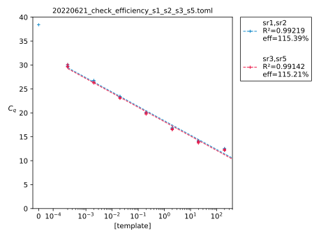

****************
Validate primers
****************

2022/06/20:

I need to verify that the primers I'm using amplify efficiently.

.. protocol:: 20220620_optimize_tm.pdf 20220620_optimize_tm.txt

.. figure:: 20220620_optimize_qpcr_tm.svg

- All three primer pairs appear to amplify cleanly.  The product bands appear 
  to be ≈200 bp instead of the expected 74 bp, but I don't expect these gels to 
  be super accurate.

- The best temperature for the 3' and 5' primers seems to be ≈60°C.  (The GFP 
  3' product anomalously drops off at 60.4°C, but I'm assuming that this is a 
  fluke.)  This is close to the 61°C I've been using so far.

- The best temperature for the midpoint primers is closer to 55°C.

2022/06/21:

.. protocol:: 20220621_check_efficiency.pdf 20220621_check_efficiency.txt

- The efficiency and R² are both much better if the 10² ng/µL data point is 
  excluded, and nearly perfect if the 10¹ data point is also excluded.  So I 
  think it's fair to say that I want to aim for template concentrations of 1 
  ng/µL or less, and :math:`C_q` values around 20.  This is consistent with the 
  general recommendations I'm aware of, and what I've seen in other experiments.

- As long as the template isn't too concentrated, both sets of primers seem to 
  work well.
