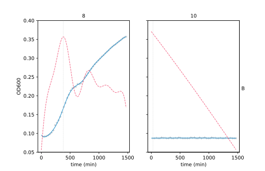
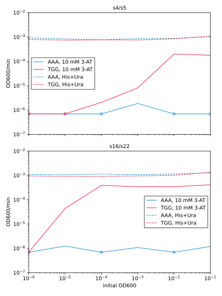
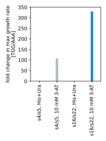

****************
Use plate reader
****************

Currently, I'm measuring bacterial fitness by plating cells on selective 
plates, the same as [Noyes2008]_ did.  However, it would be easier to use a 
plate reader.  In this experiment, I want to find a good plate reader protocol, 
and test its accuracy.

Note that I can use a plate reader for both the auxotrophic and fluorescent 
reporters, and that the assay would be slightly different in both cases.  Here 
I'm focusing specifically on the auxotrophic reporters, but I expect that many 
of the details will apply to both.

Considerations
==============
I briefly looked for plate reader protocols, and decided that [Kurokawa2017]_ 
seems like a reasonable place to start.

Evaporation
-----------
It's important to prevent evaporation, because OD600 measurements depend on 
path length.  Here are the methods I've found to deal with this:

- Lid with parafilm

  - Specifically, the parafilm is wrapped around the edge of the plate to 
    prevent vapor from escaping.

  - It seems that condensation on the plate could be a problem.  The parafilm 
    might help with that too, though.

  - Important to get lids with "condensation rings" over each well, otherwise 
    condensation from one well can get into another, leading to 
    cross-contamination.

- Mineral oil

  - This is what I've done previously, but I'm sure it impairs oxygen exchange.

I'm going to try lids to start with.

Plates
------
I need plates with the following properties:

- 96 wells
- ≈300 µL wells
- flat bottom: so path length is constant across whole well
- clear bottom: so absorbance measurements can be made
- lids with condensation rings: to minimize cross-contamination
- sterile

One thing I wasn't sure about is what kind of coating, if any, is best:

- Untreated:

  - These are considered "medium-binding".  Polystyrene is hydrophobic, so 
    hydrophobic molecules may adsorb to it.  

- Corning ultra-low attachment

  - Inert hydro-gel covalently bonded to the well surfaces to minimize binding.
  - About 33% more expensive that untreated plates.
  - I get the impression that low-binding surfaces are more important for 
    enzymatic assays.

- Tissue-culture (TC) treated plates

  - Surface made net-negative to support cell attachment [Auld2020]_
  - "The tissue culture treatment process involves exposing a polystyrene 
    microplate to a plasma gas in order to modify the hydrophobic plastic 
    surface to make it more hydrophilic. The resulting surface carries a net 
    negative charge due to the presence of oxygen-containing functional groups 
    such as hydroxyl and carboxyl. In general, this will lead to increased cell 
    attachment." 
    https://www.perkinelmer.com/lab-products-and-services/application-support-knowledgebase/microplates/plate-treatments.html
    
I think that untreated plates are the way to go.  I just don't really think 
surface binding will be a problem.  I also found this quote from Thermo: "The 
non-treated surface is available for suspension cell culture or general 
solution-based assays".

I decided to order Nunc Edge non-treated 96-well plates (Thermo 267427).  These 
have a moat around the edge, which should help with evaporation.  I can't tell 
if the lids have condensation rings or not, but I guess I'll find out.

Analysis
========
I'm trying to figure out the best way to analyze these data.

Fit to exponential function
---------------------------
My thought was to fit just the beginning of the growth curve (e.g. data points 
with OD600 < 0.2) to an exponential curve, given that bacterial growth should 
be an exponential process.  However, the data are just not exponential:

- The growth is completely flat before the culture density exceeds ≈0.1.  
  Presumably this is just because the plate reader is not sensitive enough to 
  detect changes in this regime.

- When I plot the log of the growth values, there isn't any extended linear 
  part of the curve.

Fit to a Gaussian process
-------------------------
Instead of calculating a doubling time, I probably have to calculate the 
maximum slope.  [Kurokawa2017]_ does this by looking at the point in groups of 
five, but I don't like that approach because it seems too ad-hoc and dependent 
on the interval at which measurements are made.  Instead, I want to try fitting 
the data to a Gaussian process, then calculating the maximal slope from that.

----

- A preliminary look at the data makes it seems like max growth rate is pretty 
  much independent of dilution, unless the culture is so dilute that it does 
  not start growing within the interval.  That suggests that taking the max of 
  the growth rates for each dilution would be a robust statistic.

- I wonder if rate / OD would be more robust.  Because right now I'm basically 
  only measuring the point right before the culture becomes resource limited.  
  But growth/OD gets at what I really care about, which is how fast a cell can 
  divide.  For exponential growth, rate/OD would be a constant.

  I played around with this, and I don't think it's a good idea.  The absolute 
  values stop really making sense (e.g. flat curves will have higher rate/od 
  values then growing cultures).  I tried subtracting the blank from the OD 
  values, to make OD better reflect "# of cells", but that creates a lot of 
  divide-by-zero and goes-to-infinity problems.  Even with the GP smoothing 
  things out, I think this idea is still too susceptible to the fact that my 
  measurements aren't perfect.

  Also, I kinda expected to get square-wave shaped plots, where the square 
  would represent a period of exponential growth (because f'(x) / f(x) = k for 
  f = exp).  But I didn't get that; the rate / OD plots were overall pretty 
  much the same shape as the rate-only plots.  It is a bit worrying how 
  emphatically not exponential these data are...

Results
=======
.. protocol:: 20220323_b1h_plate_reader_assay.pdf

  Grey plus signs: OD600 data recorded by plate reader.  Blue line: Gaussian 
  process regression of OD600 data. Red dashed line: First derivative of OD600 
  with respect to time.  Vertical grey dotted line: the time at which the 
  maximum growth rate is observed.

- I like the Gaussian process model.  It basically describes the situation 
  where I want to fit an unknown growth model, subject to the constraints that 
  the curve should be smooth.  Noise is handled very well.  Growth rates are 
  the only information I can extract from the model (e.g. I can't get anything 
  akin to the doubling time I could get from an exponential model), but that 
  seems to be enough to draw conclusions from.

  Growth rates as a function of initial culture dilution.  Circled data points 
  were below the minimum detectable rate, and so were assigned the minimum to 
  avoid confounding data analysis.

- Only the relatively concentrated strains in this experiment were able to 
  reach their maximum growth rates.  For future experiments, I will have to 
  either make sure the include concentrated samples, or run the experiment for 
  longer (e.g. 36h).

- I will probably want to continue measuring multiple dilutions of each 
  culture.  Even though the most dense cultures were the most useful in this 
  experiment, that might not always be true.  It's also reassuring to see 
  different dilutions of the same culture reaching the same max growth rate at 
  different times.

- These figures might be somewhat noisy, because I don't trust that the growth 
  rates for the nearly dead cultures were measured very accurately.  But if 
  anything, these figures will be underestimates of the true effect, so I'm 
  comfortable working with them.

- These data seem totally consistent with, but more quantitative than, the 
  plating experiments (:expt:`158`).  Specifically, it's clear from the plate 
  images that it matters both how many colonies there are, and how big those 
  colonies are.  Presumably this could also be quantified, but I don't think it 
  would be easy or robust.  In contrast, the plate reader data capture this 
  information naturally.

- The plate reader assay also seems to be less sensitive to initial conditions 
  that the plating assay.  Basically, because we only care about max rate, the 
  initial OD isn't important and we don't have to be so careful about getting 
  all the cultures to exactly the same density before starting the experiment.  

  That will make the experiment much easier, and perhaps more reproducible: 
  just grow overnights, maybe a short day culture to get the cells back in log 
  phase (1-2h with no need to check OD), the wash and setup the plate reader.  

- The plate reader assay will also makes it easier to test different 3-AT 
  concentrations, because I won't have to make custom plates for each one.
  
Considering everything, I think I can switch fully over to the plate reader 
assay moving forward.
