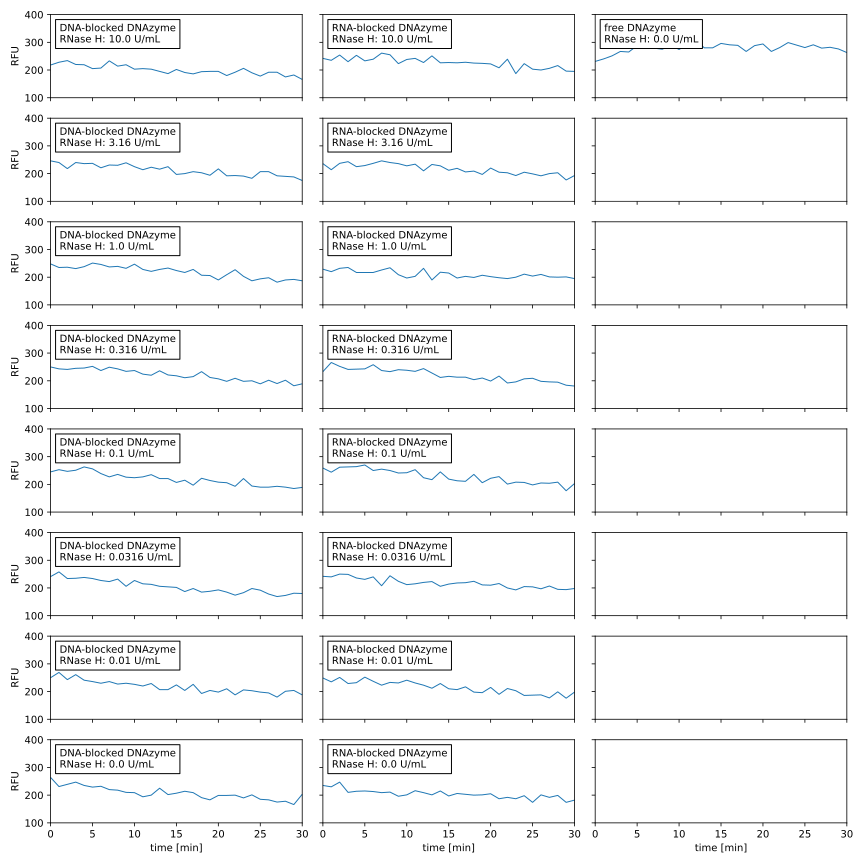
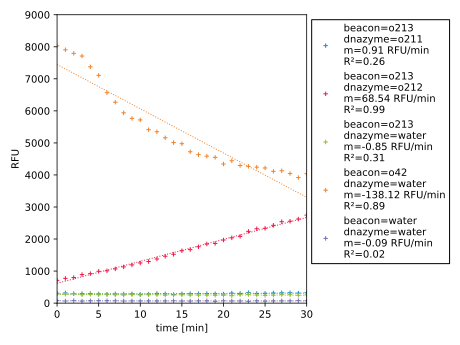
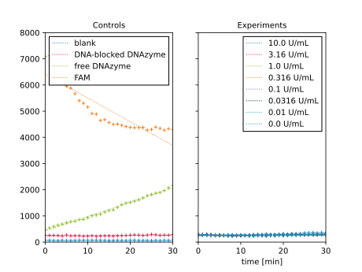

***********************
Validate Wang2017 assay
***********************

Considerations
==============

Reagents
--------
- cP1:

  - "c": "chimera", referring to the DNA/RNA hybrid
  - Sequence: CATCTCTTCTCCGAGCCGGTCGAAATAGTTGGTrGrArArGrArGrArUrG
  - Price: $83

- P2:

  - Sequence: CATCTCTTCTCCGAGCCGGTCGAAATAGTTGGTGAAGAGACG
  - Price: $6

- DNAzyme:

  - Sequence: CATCTCTTCTCCGAGCCGGTCGAAATAGTTGGT
  - Price: $5

- MB1:

  - "MB": "Molecular beacon"
  - Sequence: /56-FAM/CCACCATCACCAACTATrAGGAAGAGATGTTTGGTGG/3BHQ_1/
  - Price: $202

- MB2:

  - Sequence: /56-FAM/CCACCATCACCAACTATAGGAAGAGATGTTTGGTGG/3BHQ_1/
  - Same as MB1, but without the ribonucleotide that will be recognized by the 
    DNAzyme.
  - I don't think I need to order this oligo.  [Wang2017]_ used it as a 
    control, but I don't think I need to repeat that control.

Results
=======

Titrate RNase H --- 2020/12/08
------------------------------
.. protocol:: 20201208_validate_wang2017.txt

Observations:

- All of the wells had about 200 RFU.

- All of the wells had relatively constant signal over the 30m time course.

Conclusions:

- Since no wells had appreciable signal, the immediate problem is with the 
  positive control.

- The :download:`plate reader manual <biotek_synergy_h1_manual.pdf>` claims to 
  be able to detect 20 pM fluorescein.  My oligos have the same fluorophore, 
  and are 100 nM [Wang2017]_, so I should definitely be able to see them.

Controls --- 2020/12/11
-----------------------

Observations:

- Fluorescein itself is easily detectable, but its signal decreases over time.

- Signal increases linearly in the positive control reaction (o213/o211)

- The negative controls and the blank have relatively constant signal.

Conclusions:

- In the 2020/12/08 experiment, I forgot to add include two buffer components: 
  Tris pH=8.5 and NaCl.  Both could have been responsible for the lack of 
  activity observed for the positive control.  [Wang2017]_ shows that the 
  reaction is pH-sensitive, and the necessity of salt for a DNAzyme is 
  intuitive.

- Fluorescein itself seems to bleach over the course of the reaction, but the 
  molecular beacon (o213) doesn't.  I'm not totally sure what to make of this.

Titrate RNase H --- 2020/12/14
------------------------------
.. protocol:: 20201214_validate_wang2017.txt

Observations:

- The controls look similar to before.

- Only the 10 U/mL experiment has DNAzyme activity above the baseline.

Conclusions:

- I think the lack of Tris/NaCl was the problem in the first experiment.  I 
  corrected that here, and the controls look like they should.

- The assay seems to have a detection limit of 10 U/mL.
  
  This is much worse than the ~0.2 U/mL limit reported in [Wang2017]_, but it 
  might be enough for my purposes.  As described in :expt:`77`, I expect any 
  RNase H contamination to be ≥4.2 U/mL.  While I'd prefer if that 
  concentration were more squarely in my dynamic range, this assay as it is may 
  still be able to detect contamination.
  
- It's possible that I'm not doing the assay right, but I'm following the 
  protocol exactly as far as I can tell.

  I could also try optimizing the assay.  This could be a can of worms, but 
  there are a few obvious things to try:
  
  - Increase reaction time
  - Increase reaction temperature (NEB recommends 37°C for RNase H).
    
  In fact, it would make sense to mimic the conditions of a PURExpress 
  reaction, e.g. 37°C for 1-2h.

Ideas:

- Run gel to make sure RNase H is actually working.

- Repeat titration with higher concentrations of RNase H, to better establish 
  dynamic range.

- Try longer times and higher temperatures.
