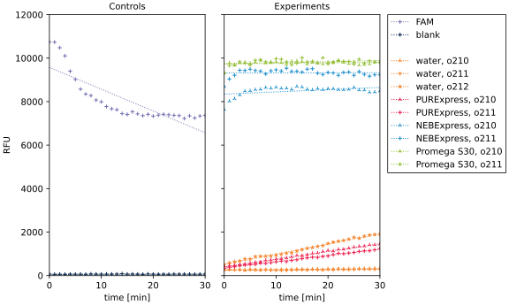
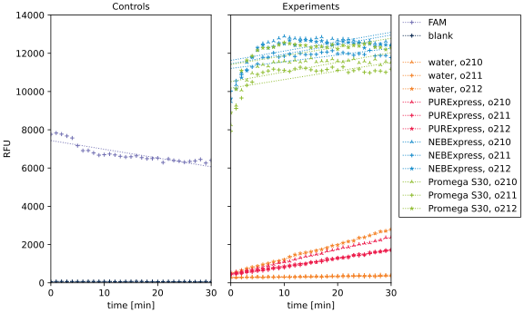
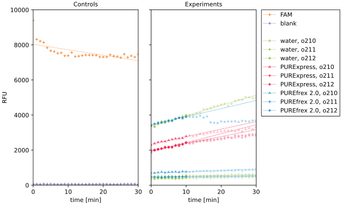

*****************************
Test extracts via [Wang2017]_
*****************************

Now that I've shown that I can detect RNase H activity using the [Wang2017]_ 
assay, I want to see if I can detect RNase H activity in any of my *in vitro* 
translation systems.

Results
=======

2020/12/16
----------
.. protocol:: 20201216_detect_rnase_h.txt

To do:
- Should repeat with the following controls:

  - −DNAzyme, to really see what the baseline fluorescence looks like.
  - −beacon, −DNAzyme same idea.
  - o212, to see if signal is detectable.
  - o211, really just checking that the assay works.

2021/01/13
----------
.. protocol:: 20210113_detect_rnase_h.txt

Observations:

- The lysates have very high fluorescent backgrounds, and the linear fits for 
  these curves do not match the data well at all.

- NEBExpress has low fluorescent background, but a fairly significant slope in 
  all conditions.  This may indicate that something in NEBExpress can cleave 
  the molecular beacon (o213) on it's own.

- The slopes in the water controls are greater than they have been previously 
  (~4.1 and 2.3 this time; 2.1 and 1.3 on 2020/12/16; 1.4 and 0.7 on 
  2020/12/15).  It's also interesting that the o210 (RNA-blocked DNAzyme) 
  control consistently has a slope ~2x greater than the o211 control 
  (DNA-blocked DNAzyme).  This might reflect the intrinsic difference in 
  stability between RNA and DNA.

- In the PURExpress conditions, the positive control (o212) has the same signal 
  as the negative control (o211), even as the experimental sample (o210) has 
  much higher signal than either.  I can't make sense of this, especially 
  considering that the positive and negative controls worked well in the water 
  conditions.

Conclusions:

- The results for the lysates are meaningless and should be ignored.

- There may be RNase H activity in PURExpress, but I'm hesitant to make any 
  strong conclusions because the positive control doesn't make sense.  That 
  said, in both PURExpress replicates the o210 well had a significantly greater 
  slope that the o211 sample, and it'd be surprising if PUREfrex had RNase H 
  activity and PURExpress didn't.

2021/02/03
----------
.. protocol:: 20210203_detect_rnase_h.txt

Observations:

- I only used the first 10 min of data for the fits, because the plate sat in 
  the plate reader (at 37°C) for ~15 min while the plate reader cooled itself 
  down to 30°C, and the data didn't seem very linear after about 10 min.

  For this experiment, I think it's probably more informative to look at the 
  raw fluorescence values at :math:`t=\pu{0 min}` rather than the slopes.  For 
  instance, the PURExpress/o210 sample has a slightly lower slope than the 
  PURExpress/o211 sample, but starts at a higher level.  This probably means 
  that the o210 trace initially had a higher slope, and therefore started 
  running out of substrate earlier.  So take the bar plots (which are based on 
  the slopes) with a grain of salt.

- The controls work well for PUREfrex, but (as I've seen before) not for 
  PURExpress.  It'd good to know that the previous PURExpress results weren't 
  just a fluke, although I don't really have any idea what's happening to the 
  positive control.  Maybe there's some DNase activity in PURExpress?  That 
  seems unlikely, though.
  
  In any case, the PUREfrex controls give me a lot of confidence in the 
  PUREfrex data.  

- There does seem to be RNase H activity in PUREfrex.  I compared the o210 
  slope to the standard curve I measured in :expt:`82`, and I'd say the RNase H 
  activity is between 10-30 U/mL.  It's hard to say for sure, because the 0 
  U/mL control has a lower slope in that experiment (1.6 RFU/min) than this one 
  (3.1 RFU/min).  The slope of the PUREfrex/o210 sample (7.1 RFU/min) is 
  comparable to that of the 31.6 U/mL control (9.8 RFU/min), but the o210/o211 
  ratio of the PUREfrex sample (2.3x) is more comparable to that of the 10.0 
  U/mL control (4.7 RFU/min, 3.0x).  On top of that I don't think the slopes 
  from this experiment are particularly reliable, but 10-30 U/mL seems like a 
  reasonable range.

Discussion
==========
- There does seem to be RNase H activity in PUREfrex.  The data for PURExpress 
  is less clear, but if I had to guess, I'd say it has RNase H activity as 
  well.  Furthermore, the level of RNase H activity appears to be above to 4.2 
  U/mL threshold that would be necessary to degrade all of my mRNA 
  (:expt:`77`).  Based on this conclusion, I think it make sense to move 
  forward with strategies to eliminate RNase H activity, e.g. :expt:`89`, 
  :expt:`88`

- I won't be able to use assays with fluorescent readouts to measure RNase H 
  activity in lysates.  [Wang2017]_ claimed to measure RNase H activity in 
  lysates, and got around the background fluorescence problem diluting the 
  lysate 100-fold.  I don't think the assay would be sensitive enough to detect 
  activity if I did the same, though.

  I might be able to measure RNase H activity in these samples using a qPCR 
  based assay.  See :expt:`87`.
