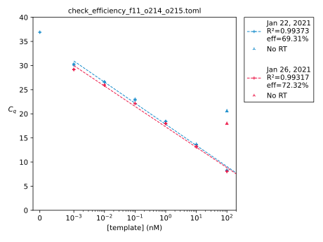

*******************
Validate qPCR assay
*******************

I had the idea that I could use qPCR to detect RNase H activity.  This would 
have the advantage of being insensitive to the fluorescent background of the 
sample, and potentially quite sensitive.  The basic protocol would go something 
like this:

- Anneal (and maybe desalt):

  - a 100 nt ssRNA
  - a 20 nt DNA primer that anneals in the middle of the ssRNA.

- Incubate with RNase.

- Reverse transcribe.

- qPCR using primers that span the potential cut site.

I look briefly to see if an assay like this has already been described.  I 
found [Dobosy2011]_, which is an interesting idea to use RNase H to eliminate 
primer dimers and other incorrect PCR products, but not an RNAse H assay.  I 
didn't find anything else.

I don't want to waste too much time on this idea, but I think it's worth a 
quick try.

Considerations
==============

ssRNA template
--------------
- I'll have to synthesize the ssRNA myself.  IDT sell ssRNA ultramers, but 
  they're prohibitively expensive.

- If I were to design an ssRNA sequence specifically for this experiment, it 
  would look like this:

  - BsaI (in case I want to clone it)
  - T7 promoter
  - 20 nt: qPCR forward SR primer
  - 20 nt: spacer
  - 20 nt: RNA/DNA duplex SR primer
  - 20 nt: spacer
  - 20 nt: qPCR reverse SR primer
  - BsaI

  I might not even need to do any cloning; I could just order a gBlock or 
  ultramer and amplify it with PCR.

  .. update:: 2021/02/01

    Get ultramers; you get about 1000x more DNA for about the same price.  The 
    smallest gBlock is 125 bp (MW=76082.9) and you get 250 ng.  That works out 
    to 3.28 pmol.  In contrast, with ultramers you can get either 4 or 20 nmol.

  The Zymo RNA Clean & Concentrator kits recover all RNA >17 nt, so I don't 
  need to worry about not being able to purify these constructs.
      
- It'll be easier to just use an RNA I already have, though.  I think the best 
  candidate is f11:

  - I have relatively a lot (5 aliquots)
  - It's relatively concentrated (10 µM)
  - It's relatively short (388 nt)

- How much ssRNA to use?

  - My IVTT reactions have 0.3 pmol: :expt:`77`

  - The Takara SMART MMLV protocol calls for 10-1000 ng of poly-A RNA:

    - Average mRNA length: 2.2 kb (Bionumber 101469)
    - Average mRNA MW: 339.5 Da/nt × 2200 nt = 746900 Da
    - mRNA per reaction: 13-1338 fmol ≈ 1 pmol

  - I'm inclined to start with 1 pmol.

Primers
-------
For f11:

- I designed primers using IDT's PrimerQuest tool:

  - First set:

    - fwd: ACTGACCCGTCATATTCGTATTC len=23 Tm=62 gc=43.5
    - rev: CAGATGATCGCTACGGCTAAA   len=21 Tm=62 gc=47.6
    - mid: AACCGTTTCAGTGCCGTATT    len=20 Tm=?? gc=45

For the duplex primer (i.e. RNase H target):

- I might want to include a ``/3InvdT/`` modification to prevent the primer 
  from being used by the reverse transcriptase.  

- I'll need to try different lengths.  Longer will probably anneal better, but 
  may be difficult for the RT to dislodge.  I think only about 4 bp is required 
  for RNase H activity.
  
Heat inactivation
-----------------
RNase H activity could easily interfere with the RT reaction.  Some way to deal 
with this:

- Do nothing:  Since the goal of the assay is to detect RNase H activity, this 
  would just be another way to get signal.

- Inactivate with heat: According to NEB, RNase H can be inactivated by 
  incubating at 65°C for 20 min.  I'm worries that such treatment might also 
  degrade my RNA, which would abolish my signal.  RNA degradation at high 
  temperatures can be avoided by controlling the pH and EDTA concentration, but 
  I don't have control over either for this assay.

- Inactivate with EDTA or proteinase K: Both of these would interfere with 
  downstream steps, so are not viable approaches.

I think that doing nothing is the best approach.

Reverse transciption
--------------------
- Enzymes:

  - AMV:

    - Less sensitive to 2° structure.
    - Intrinsic RNase H

  - MMLV:

    - Requires lower reaction temperature (37°C).
      - More sensitive to 2° structure.

    - Lower RNase H activity

      - H1 mutant in particular has low RNase H activity, and better 
        thermostability (e.g. up to 55°C).

- RNase H activity:

  - Pros:

    - I think RTs that degrade their template are considered more quantitative.

  - Cons:

    - Don't want RNase H activity of the RT to interfere/overshadow the 
      activity I'm trying to assay.
    - RTs that don't degrade their template may give better sensitivity, since 
      the signal can be amplified at that step.

- I have SMART MMLV RT (Takara) on hand, and I'm leaning towards MMLV being 
  better anyways, so I'll go with that for now.

  - Need to order dNTPs.  Takara recommends: Advantage® UltraPure PCR 
    Deoxynucleotide Mix (Cat. No. 639125)

qPCR
----
I didn't really think about this, but one-step qPCR may have made more sense 
than two step qPCR.  I'll stick with two-step for now, though, since I have all 
the reagents already.

Results
=======

2021/01/21 --- Optimize :math:`T_A`
-----------------------------------
.. protocol:: 20210121_01_pick_ta.txt

Observations:

- There's isn't a clear :math:`T_A` minimum, although lower temperatures appear 
  better.  This is the same pattern I saw repeatedly in :expt:`43`.  I don't 
  believe these data; I think there's something wrong with the thermocycler.

Conclusions:

- I'm just going to use :math:`T_A = 60°C` going forward.  The SsoAdvanced 
  protocol doesn't actually even call for :math:`T_A` optimization, it just 
  calls for always using 60°C.

2021/01/22 --- Check efficiency
-------------------------------
.. protocol:: 20210122_02_validate_rt_qpcr.txt 20210126_02_validate_primers.txt

Observations:

- The :math:`R^2` values are above 0.99, which isn't bad, but the data points 
  have a distinct downward curve to them.

- The efficiencies are very poor.  This could mean that something is inhibiting 
  the PCR reaction, but most likely the primers just aren't very good.

- The −RT control has a very significant amount of signal.  Presumably this is 
  leftover DNA from the in vitro transcription reaction.  Normally I don't care 
  whether there's leftover DNA or not, so I use a ton of template and skip the 
  DNase treatment step.  For this assay, though, I should probably include that 
  step.

- I repeated this experiment because I initially thought that the small volumes 
  being pipetted in the first replicate would lead to significant errors.  I 
  modified the protocol for the second replicate to always pipet at least 2 µL 
  for any step involving the template.  However, the data from both replicates 
  are very consistent.

Conclusions:

- I'm going to design a template specifically for this experiment.  I initially 
  decided to use a template I already had, but seeing as how I'll have to 
  purify new RNA anyways, I might as well use an ideal template.
