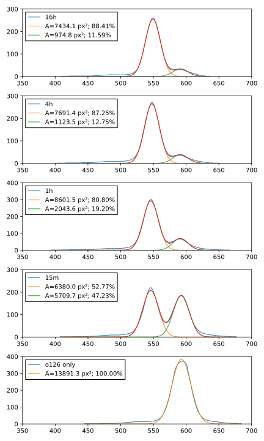

*******************************
Make linker via click chemistry
*******************************

An alternative to synthesizing a branched oligo [Naimudden2016]_ is to couple 
two linear oligos: one with the puromycin arm, and the other with the RT and 
and ligation arms.  [Mochizuki2011]_ and [Arai2020]_ take this approach, using 
NHS-ester and maleimide chemistry to couple the two oligos via a small linker 
(EMCS).  The protocol for that coupling is somewhat involved, though.  Click 
chemistry seems significantly simpler, so I want to try that approach here.

The advantage of using two oligos is that I can more easily experiment with 
different linker lengths and sequences.

Considerations
==============

Copper catalyst
---------------
Traditional click reactions use a Cu(I) catalyst.  Fitzy warned me that the 
Cu(I) catalyst can degrade DNA, but there are also many reports of people using 
the Cu(I) catalyst with DNA oligos.  I think the way people handle this is just 
by doing really short reactions, potentially preventing the reaction from going 
to completion, but I'll have to do some more reading to say for sure.

Alternatively, I could use copper-free click, which uses cyclooctyne rather 
than a terminal alkyne.  The ring strain in the cyclooctyne helps the reaction 
proceed efficiently without a catalyst.  According to Fitzy, these reactions 
are not as efficient copper-catalyzed click, but can make up for that with 
significantly longer reaction times.  `Glen research 
<https://www.glenresearch.com/reports/gr24-14>`__ gives a simple protocol and 
suggests that the reaction could go to completion in 4-17 hours.

Biotin
------
[Mochizuki2011]_ and [Arai2020]_ employ linkers containing biotin.  This allows 
for a nice workflow where everything happens on streptavidin beads, so that the 
product of each step can be easily purified.  More specifically, the workflow 
looks something like this:

- Bind RT/biotin/ligation oligo to streptavidin beads.
- Couple puromycin oligo, wash.
- Anneal mRNA, ligate [Mochizuki2011]_ or UV crosslink [Arai2020]_, wash.
- Express protein, react with puromycin, wash.
- Reverse transcribe mRNA, wash.
- Free DNA/protein conjugate from beads with RNase T1.

The disadvantages of using biotin are:

- The modified oligo is expensive.  Not only does a modified nucleotide 
  containing biotin need to be added, but two RNA nucleotides also need to be 
  added so that the linker can be released from the streptavidin beads with 
  RNase T1.  Together, these modification bring the price of the oligo involved 
  from $150 to $350.  This is also the oligo I foresee wanting to optimize the 
  most, so the difference in price could add up.

- The capacity of the beads may limit throughput.  [Mochizuki2013]_ describe 
  how a 200x excess of bead capacity is needed to get complete binding (after 
  protein expression and capture).  I want to bind on the order of 1 nmol (1e14 
  molecules).  That `corresponds 
  <https://www.thermofisher.com/us/en/home/references/protocols/proteins-expression-isolation-and-analysis/protein-isolation-protocol/dynabeads-myone-streptavidin-c1.html>`__ 
  to about 2 mg of beads at 1x capacity---400 mg at 200x capacity---assuming 
  that my constructs can be considered ssDNA oligos.  The beads are 10 mg/mL 
  and cost about $200/mL, so this would be a couple thousand dollars and ~40 mL 
  of beads per experiment, neither of which seems particularly realistic.

[Naimudden2016]_ doesn't use biotin, perhaps because of these disadvantages.  I 
don't think I need it, either.  I can use MWCO spin columns to clean up my 
mRNA, and I don't think I'll need to purify the PURExpress reaction before 
doing the selection. 

Puromycin arm length
--------------------
An advantage of using click chemistry is that I can more easily experiment with 
the length of the various arms.  I became interested in the length of the 
puromycin arm because [Naimudden2016]_ claimed to improve the linker by 
considering the dimensions of the eukaryotic ribosome.  Since I'm using 
prokaryotic ribosomes, which are smaller than eukaryotic ones, it may be that a 
different length linker would be optimal for me.

- A number of different puromycin arms have been used for cDNA/mRNA display:

   - 27x dA: [Roberts1997]_ (the original mRNA display paper) and 
     [Barendt2013]_ (the only other mRNA display paper I've read).
     
   - 4x Spacer-18: [Mochizuki2011]_ and most of the earlier cDNA display papers

   - 18x dA + 4x Spacer-18: [Naimudden2016]_

- Most likely, the arm from [Naimudden2016]_ would work fine.  Prokaryotic 
  ribosomes aren't that much smaller than eukaryotic ones, and while 
  [Naimudden2016]_ showed that the 18 dA arm worked the best, display wasn't 
  extremely sensitive to changes in linker length.  The 10 dA and 0 dA arms 
  still worked about half as well as the 18 dA arm.

- That said, I think that it might be better to not use Spacer-18 at all in the 
  puromycin arm:

  .. update:: 2020/09/03

    [Liu2000] has data showing that the PEG spacer actually improves mRNA 
    display.  So the arguments below are probably wrong.

  - PEG has a much shorter persistence length than ssDNA:

    ===========================  =======  ===========================
    Parameter                      Value  Reference
    ===========================  =======  ===========================
    oligo-dT monomer length        6.3 Å  [Murphy2004]_
    oligo-dT persistence length   25.0 Å  [Murphy2004]_ (100 mM NaCl)

    PEG monomer length             3.5 Å  (pymol measurement)
    Spacer18 monomer length      6×3.5 Å
    PEG persistence length         3.8 Å  [Kienberger2000]_
    ===========================  =======  ===========================

    The parameters for ssDNA depend on salt concentration and (to a lesser 
    extent) sequence (more so if the sequence can form hairpins).  The above 
    values were measured for oligo-dT in 100 mM NaCl, which I think mimics my 
    experimental system fairly well.  Still, even studies that look at 
    different sequences/salt concentrations report fairly similar values.

  - The `wormlike-chain model 
    <https://en.wikipedia.org/wiki/Worm-like_chain>`__ can be used to 
    calculate the average end-to-end distance of semi-flexible linkers with 
    ssDNA and PEG.  The relevant equation is below, where :math:`R` is the 
    end-to-end distance, :math:`P` is the persistence length, and :math:`L_0` 
    is the "contour length", or the length of the fully extended polymer:

    .. math::

        \langle R^2 \rangle = 2 P L_0 \left[ 1 - \frac{P}{L_0} \left( 1 - 
        e^{-L_0/P} \right) \right]

    In the limit that :math:`L_0 \gg P`, this simplifies to:

    .. math::

        \langle R^2 \rangle = 2 P L_0

  - The distance between where the mRNA exits the ribosome and where 
    puromycins binds in the A-site is about 85Å.  Additionally, the shortest 
    physical path between these two points (i.e. not going through the 
    ribosome) is about 185Å.  I determined these distances by aligning 4V5D 
    and 1Q82 in pymol.  4V5D shows where the mRNA exists the ribosome and 
    where the tRNAs bind, while 1Q82 show where puromycin binds.  Both are 
    prokaryotic ribosomes.

    :download:`ribosome_puro.pse`

  - I assumed that the ideal linker length would be the one where the average 
    end-to-end distance would equal the target end-to-end distance (provided 
    that the linker length is at least as long as the shortest path length).  
    This assumption is a bit sloppy, but probably about right [Liese2015]_:

     - Really what I care about is the effective concentration, which requires 
       a volume normalization.  But there is a consistent relationship between 
       average end-to-end distance and effective concentration.

     - This doesn't account for the excluded volume of the ribosome.

     - This also doesn't account for potential interactions between the linker 
       and the ribosome (e.g. ssDNA may be more likely to interact with the 
       ribosome than PEG).

  - In the case that :math:`L_0 \gg P`, the ideal linker-length is easy to 
    calculate:

    .. math::

        L_0 = \frac{\langle R^2 \rangle}{2 P}

    The general case cannot be computed analytically, but can be solved 
    numerically.  I went to the effort to do this because ssDNA is somewhat in 
    the intermediate domain.

  - Given :math:`L_0`, the length of the linker in terms of the number of 
    monomer units can be calculated as follows, where :math:`N` is the number 
    of monomers and :math:`b` is the length of a single monomer:

    .. math::

        N = \frac{L_0}{b}

  - Solving the above equations gives the following ideal linker lengths for 
    Spacer-18 and poly-dT::

        $ ./wlc_end_to_end.py

    ==========  ===========  =========
    Monomer     :math:`L_0`  :math:`N`
    ==========  ===========  =========
    Spacer-18         919 Å         44
    dT                164 Å         29
    ==========  ===========  =========

    Note that the ideal length dT oligo is slightly shorter than the minimum 
    path length I measured (185 Å).  :math:`N = 29` is calculated based on the 
    minimum path length, not the :math:`L_0` in the table.

  - Spacer-18 requires a much longer polymer than dT to reach the same average 
    end-to-end distance.  This was counter-intuitive to me at first, but it 
    makes sense because PEG is much floppier (i.e. is has a much shorter 
    persistence length).  In effect, it's taking a random walk with shorter 
    steps, so it's hard for it to get as far.  Another way to think about it 
    is that Spacer-18 has more conformational entropy, so it's harder to 
    extend it as far.

  - I expect that the 27x dA spacer commonly used for mRNA display is in fact 
    also the best linker for cDNA display.  It's interesting that the length 
    of this spacer (27) corresponds very closely to the optimal lengths I 
    calculated (29 considering the minimum path length, 26 ignoring it).  It's 
    also worth pointing out that [Roberts1997]_ successfully used a 21x dA 
    linker, which suggests that my minimum path length is an overestimate.
    
    Note than mRNA display uses dA in the spacer because it's known to halt 
    translation [Roberts1997]_.  That consideration isn't relevant to cDNA 
    display, but   [Naimudden2016]_ also uses dA for a different reason: 
    compatibility with commercially available oligo-dT beads.  dA may have a 
    longer persistence length than dT, due to increased base stacking, but the 
    difference probably isn't significant.  I'm going to stick with oligo-dA.
    
  - I expect that the 4x spacer-18 spacers used by [Mochizuki2011]_ and others 
    are actually pretty bad.  They are only about 90 Å at full extension, 
    significantly shorter than the minimal path length I measured (185 Å), and 
    their average end-to-end distance would be much shorter than that.

    The 18x dA, 4x spacer-18 spacer used by [Naimudden2016]_ is better, but 
    mostly because it adds dA; I don't think the spacer-18 is doing much 
    (besides making the oligo more expensive).

I want to try using a 27x dA arm, because it will be relatively cheap, and I 
think it will work well.

Branch location
---------------
The linkers used for cDNA display typically have ~21 nt of complementarity with 
the mRNA.  5 of these are in the "RT primer" arm (e.g. 3' of the branch point) 
while the rest are in the ligation arm (e.g. 5' of the branch point).  It is 
worth noting that all of the nucleotides in the ligation arm are either G or C.  
I have wondered if the location of the branch matters.  For instance, if the 
branch could interfere with binding of the reverse transcriptase, maybe it 
would make sense to make the RT arm longer (see :expt:`6` for more discussion 
of this topic).  

The branch point is also relevant to click chemistry because the azide has to 
be attached to a dT nucleotide, which would ideally correspond to an rA 
nucleotide in the mRNA.  This means that I have to do one of two things:

- If I want to keep the branch point in the same relative position as in 
  [Naimudden2016]_, I need to either make new versions of my plasmids with A in 
  the corresponding spot, or accept that there will be a mismatch.  I don't 
  really want to have a mismatch, because even if it shouldn't be a big 
  problem, it could be.  It's worth nothing, though, that the RT arm in 
  [Naimudden2016]_ is attached through the 5-Me-dC spacer rather than the 
  normal backbone, which might cause a lesion similar to a mismatch.

- Move the branch point to where there's already an A.  Unfortunately, there 
  aren't many options in this regard, because the Y-tag sequence is almost 
  entirely G or C.  The best option is closer to the 3' end than the current 
  branch point, which would make the RT arm even smaller than before.  Given 
  that I've been thinking about making the RT arm even longer, I don't really 
  want to make it shorter.  Instead, I'd prefer to simply extend the primer in 
  the 3' direction.

My plan is to move the branch point and extend the primer.  I'm already 
changing a bunch of things about the linker, so there's not much point in going 
out of my way to keep this detail identical.

Results
=======

Optimize reaction time --- 2020/08/03
--------------------------------------
.. protocol:: 20200803_optimize_click_time.txt

.. figure:: 20200804_click_linker_488_658.svg

I wrote a custom script to quantify how far each reaction progressed, because 
the bands overlapped enough that I didn't think it would be accurate to do it 
by hand.  The script just attempts to fit a Gaussian to each peak, then 
compares the area under the two curves::

  $ ./fit_bands.py

  blue: pixel intensity curves from ImageJ.  orange, green: Gaussian curves fit 
  to individual bands.  red: Sum of orange and green curves.  The red line 
  should match the blue line as well as possible.

- The coupling reactions seem to work pretty well, going to about 90% 
  completion overnight.  The reaction seems to be complete after just 4h, so 
  that's the time I'll use going forward.  For comparison, Fitzy incubates her 
  Cu-free click reactions for 2h, so I'm in the same ballpark.

- In the future, it might be better to use PAGE instead of 2% agarose gels to 
  better resolve the coupled and uncoupled species.  That said, I think I was 
  able to resolve the peaks pretty well with my script.

- I think that the SYBR Gold signal is being quenched by Cy5 in the "coupled" 
  bands.  Cy3 and Cy5 are a common FRET pair, and SYBR Gold has a similar 
  emission spectrum to Cy3.  (I don't think GelGreen would have this problem, 
  which is another argument for running PAGE gels.)  It'd be nice if I could 
  use the blue laser with the Cy5 filter to actually see the FRET.  I think 
  there might be a way to do this with the Typhoon...

  In short, I'm not going to read too much into the green bands disappearing 
  (other than that the pattern of intensities is consistent with the reaction 
  going to completion).

  .. update:: 2020/08/07

    Maybe I shouldn've used the green laser (520 nm) to image SYBR Gold.

Synthesize o128 --- 2020/08/07
------------------------------
I used the same protocol as above to synthesize o128, which includes Spacer18 
phosphoramidites in the puromycin arm in the same manner as Linker-N (o130).  I 
don't think that the Spacer18 phosphoramidites will be helpful (see 
considerations above), but it's still worth trying.

.. protocol:: 20200807_gel_gelgreen_laser_scanner.txt

  - Mix the following reagents

    - 1 µL 400 µM o125
    - 1 µL 400 µM o127
    - 2 µL 2x PBS

  - Incubate at room temperature, in the dark, overnight

.. figure:: 20200807_check_o128.svg

.. datatable:: 20200807_check_o128.xlsx

- I incubated the reaction overnight purely because that worked best with my 
  schedule.  As shown above, I think a 4h incubation is enough.

- The o129 reaction seemed to proceed just as well as the o128 reaction.

- Staining the DNA with GelGreen allows me to see the product band in both 
  channels.  I think I just have to avoid using Cy5 and SYBR Gold together.

- The GelGreen signal in this gel was pretty faint (the above figure is 
  white-balanced, which hides this to an extent).  Some possible explanations:
  
  - I was reusing a solution of 3x GelGreen from before the COVID shutdown (so 
    ~5 months old).

  - These oligos are ssDNA, which is not bound as well by GelGreen.

  I think the old dye is the most likely culprit.

- The differences between the Cy5 and GelGreen channels are interesting:

  - In the Cy5 channel, both reactions appear to go to 90% completion, in 
    agreement with what I observed previously.

  - In the GelGreen channel, the o128 reaction appears to go to 90% completion 
    (in agreement with the Cy5 channel), while the o129 reaction only goes to 
    50%.

  I don't know why the o129 reaction doesn't appear to go to completion in the 
  GelGreen channel.  Perhaps the reason is just that the GelGreen signal is too 
  faint, although normally even faint signals are pretty reliable.

  I'm not too worried about the discrepency, though, because I think the Cy5 
  channel is more reliable.  It's brighter, and I know that each puromycin arm 
  oligo has exactly one Cy5 fluorophore.
  
- The puromycin arm seems to have a small amount of slow-running (e.g. high-MW 
  or less-charged) contaminant.  This is visible in each lane with a puromycin 
  arm.  The contaminant seems to have the 5' DBCO, though, because it is 
  shifted in the presence of the anneal/RT arm.

- I'm pretty sure that the formamide ruined the ladder.  Not a big problem, 
  though; I still know what all the bands are.  If I really care, I could use 
  an ssRNA or ssDNA ladder in the future.

- It's weird that the ladder is visible at all in the Cy5 channel.  Presumably 
  that's due to some sort of crosstalk.

Optimize salt and temperature --- 2021/04/06
--------------------------------------------
.. protocol:: 20210405_optimize_click_freeze.txt

  - Cy5: intensity level 1
  - SYBR Green II: intensity level 9

.. figure:: 20210406_optimize_click_freeze.svg

Observations:

- I nearly ran the ligation/RT oligo off the bottom of the gel.  This makes it 
  hard to quantify that oligo, but you can still see what's going on 
  qualitatively.  Next time I'll only run the gel for 30 min.

- The yields calculated using the Cy5 and SYBR Green II channels have 
  significantly different magnitudes (although the same qualitative trends).  
  Part of this could be related to the gel being overrun, but I think it's also 
  likely that my stock concentrations are inaccurate and that I added an excess 
  of the ligation/RT arms (o233).

- PBS clearly helps the reaction.

  Although one of the −PBS reactions gives good yield, the other two don't.  
  I'm suspicious that this one good reaction might be a fluke, e.g. some 
  stochastic effect of a mistake setting up the reaction.

- The room temperature incubation also seems to help, although the effect is 
  less dramatic.  This probably means that the act of freezing is not what gets 
  the reaction to 100%.  More likely is just that the reaction continues 
  (slowly) at −20°C---perhaps because the solution doesn't actually 
  freeze---and gets closer to 100% over a week or two.

Conclusions:

- When making o128, I also saw a discrepancy between the GelGreen and Cy5 
  channels, although only for one of the samples.  (Note that I did not 
  normalize for the different lengths of the 2 oligos in that experiment, so 
  those percentages are probably an overestimate.)

  Then as now, I'm inclined to put more trust in the Cy5 channel, because it's 
  a bright fluorophore than I know for sure is present 1x per molecule.

- My yield (in the Cy5 channel) is a little worse this time (≈80%) than it was 
  previously (≈90%).  I'm not sure what the difference is, but for now I'm 
  going to attribute it to random variation.
