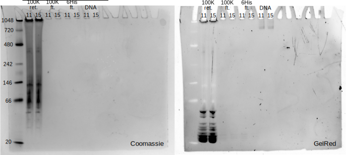
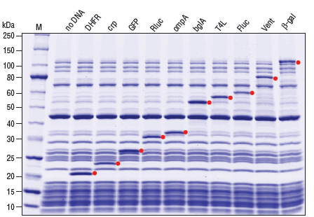

***********************
Express Zif286 in vitro
***********************

My first attempt to express Zif268 in vitro using PURExpress didn't seem to 
work, so I'm going to take a closer look and figure out what's going on.

2019/06/03
==========

.. protocol::

   - Express Zif268 using PURExpress:

      - Base protocol: https://www.neb.com/protocols/0001/01/01/protein-synthesis-reaction-using-purexpress-e6800

      - Master mix (2.2 rxns):

         - 8.8 µL solution A
         - 6.6 µL solution B
         - 1.1 µL 1 mM ZnOAc
         - 0.44 µL 40 U/µL RNase inhibitor
         - 2.86 µL water

      - For each reaction:
         
         - 9 µL master mix
         - 1 µL 100 ng/µL template

      - Incubate at 37°C for 2h

   - Purify Zif268:

      - Base protocol: https://www.neb.com/protocols/0001/01/01/purification-of-synthesized-protein-using-reverse-his-tag-purification-e3313

      - Prepare 10/9x TBS + ZnOAc:
         
         - 22.22 µL 10x TBS --- Note: I intended to use PBS, but the PBS I ordered 
           hadn't arrived yet, so I scavenged some TBS.  Both are buffers with 
           about the same pH, but PBS is less likely to interfere with the Ni-NTA.
         - 11.11 µL 1 mM ZnOAc
         - 166.67 µL water

      - Add 90 µL 10/9x TBS + ZnOAc to each 10 µL reaction.

      - Transfer diluted reactions to AMicon 100K filters

      - Spin 15000g, 30 min, 4°C

         - There was about 18 µL left in the filter, and 67 µL in the 
           flow-through.  I don't know what happened to the other 15 µL.  Maybe 
           wetting the filter?

      - Add 10 µL magnetic Ni-NTA beads
         
         - I had to borrow magnetic beads because I didn't have the spin columns I 
           needed for the agarose ones.
      
      - Rotate at 4°C for 70 min

         - The protocol calls for 15-30 min, but I left it going until I could get 
           to it.
         - The tubes fell off the rotator at some point, so I don't know how long 
           they were really mixing for.

   - Run native PAGE

      - Decided to load 10 µL based on an expected maximum yield of 2 µg.

      - Prepare each sample:

         - 7.5 µL protein
         - 2.5 µL 4x sample buffer

         .. note::
            I decided to load 10 µL based on a recommended load of 0.5 µg/band and 
            an expected yield of 2 µg/200 µL.  The maximum recommended load is 15 
            µL.

      - Prepare the anode buffer:

         - 50 mL 20x running buffer
         - 950 mL water

      - Prepare the cathode buffer:

         - 10 mL 20x running buffer
         - 1 mL cathode additive (blue) --- Note: In the future I should add 10 mL 
           of cathode additive to make the "dark blue" cathode buffer, so that I 
           can do the rapid staining protocol.
         - 170 mL water

      - Run 150V, 120 min.

      - Fix in 200 mL 40% MeOH, 10% AcOH for 15 min.  Repeat once.

      - Stain with 100 mL AcquaStain overnight.

         .. note::
            I meant to stain with regular Coomassie, but I forgot to order it, and 
            this is all I could find in lab.

      - Destain for ~2h in water.

      - Stain for ~1h in 1x PAGE GelRed.

   Expression and purification of Zif268-repA.  100K ret.: Retentate from the 
   100K spin column.  This should be just the ribosomes.  100K ft.: 
   Flow-through from the 100K spin column.  This should include the expressed 
   protein (Zif268-repA) and a number of non-ribosomal proteins included in the 
   reaction.  6His ft.: Flow-through from the Ni-NTA resin.  This should be 
   only Zif268-repA.  DNA: The plasmids added to the PURExpress reactions.  
   This was meant to check that free DNA runs differently than DNA bound to 
   Zif268-repA.  11: Positive control DNA, i.e. DNA containing a Zif268 binding 
   site.  15: Negative control DNA, the same as 11 but with the binding site 
   mutated.

- The native gel seemed to work well, because the ladder looks exactly like it 
  should.  That's nice, because this is my first native gel.  The DNA is also 
  visible in the rightmost lanes, which means the double-staining also worked.  
  The rRNA also shows up really clearly at the bottom of the first two lanes, 
  which is cool.

- I don't see any of the proteins that should be in the PURExpress reaction.  
  This might mean that I left something out of the reaction.  It also might 
  mean that the quantity of protein is below the detection limit of the stain.  
  I did 10 µL reactions (rather than the recommended 25 µL) on the advice of 
  Dan Weigand.  Maybe I should use the bigger volume while troubleshooting.  
  That said, this gel really looks like no protein, and 2.5 x 0 is still 0.  
  Another possibility is that the proteins got stuck on the spin column, 
  somehow.  Do I need to do something to prepare the columns before use, like 
  equilibrate in buffer?

- I'm assuming the first two lanes are so smeary because this is a native gel.  
  For troubleshooting PURExpress in the future, I'm going to use denaturing 
  gels.
  
- Since I'm having trouble with expression, I'm going to try expressing some 
  control proteins: (i) DHFR, which comes with the PURExpress kit, and (ii) 
  GFP, which Ben has used, and which I should be able to just see.  I also 
  ordered some SDS-PAGE gels for this.

2019/06/05
==========
Rather than adding full plasmids to the reaction, amplify only the sequences 
needed for the experiment, i.e. Zif268 + repA + CIS + ORI.  Additionally, 
amplify a negative control containing only Zif268 and repA.  This will show the 
MW of the protein component, without the possibility of DNA binding.

.. protocol:: 20190605_pcr.txt
   
   - Primers:

      .. datatable:: primers.xlsx

   - Purify reactions via PCR cleanup

.. figure:: 20190605_amplify_zif268_repa_gene.svg

- All the products were clean.

- The full length primers didn't amplify well.  Because there was some product, 
  though, I think optimizing the Tm might be enough to get better yield.  I'm 
  going to try that before ordering new primers.

2019/06/06
==========
Gradient PCR for full length amplicon.

.. protocol:: 20190606_pcr.txt

   - I should've used the ``-m primers,dna`` flag; I did add everything to the 
     master mix.

.. figure:: 20190606_gradient_zif268_repa_gene.svg

- I'm not actually sure which temperature each well was at.  The thermocycler 
  had four blocks of 2 wells each.  I set the blocks to the indicated 
  temperatures, but I don't know if both wells in the block got the same 
  temperature, or if there was some sort of gradient, or what.  

- It looks like there's a bit of a secondary product at low temperatures.

- I think 58°C for this amplicon should be good in the future.

2019/06/07
==========
.. protocol::

   - Dilute DNA such that the ORFs are 83 ng/µL.

      .. datatable:: 20190607_dilute_templates.xlsx

         Note that for 11, the whole plasmid is 3468 bp but the ORF is only 
         1644 of those.  So although the plasmid is 506 ng/µL, the ORF is 
         effectively 175.8 ng/µL.  This is accounted for in the calculation 
         above.

   - Setup reactions:

      .. datatable:: 20190607_setup_purexpress.xlsx

         Note that I only added ZnOAc to the Zif268 reactions.  In retrospect, 
         I think this was a mistake.  I want to be sure the reactions work with 
         ZnOAc (although I don't think this is the problem).

      - Add A before B, as specified by NEB.

      - Add 20.75 µL master mix to each reaction.

   - Incubate at 37°C for 2h

   - Prepare samples for SDS-PAGE:

      - 2.5 µL sample (`what NEB used 
        <https://www.neb.com/products/e6800-purexpress-invitro-protein-synthesis-kit#Product%20Information>`_)
      - 10 µL LDS
      - 4 µL reducing agent
      - 23.5 µL water

      - Incubate at 70°C for 10 min

   - Run SDS-PAGE:

      - Load 40 µL
      - Run at 200V for 22min

      .. note::
         I definitely shouldn't have loaded all 40 µL.  The wells only hold 20 
         µL.
         
.. figure:: 20190607_purexpress_controls.svg

   Control PURExpress reactions.  Left: protein stained by Coomassie.  Right: 
   DNA statined by GelRed.  Each control occupies two lanes because the wells 
   overflowed when I was loading them.  The DHFR control should be about 20 
   kDa.  11 and 11 - ORI should both be 33 kDa.  I'm not sure how big the GFP 
   gene is.

- The gel is really bad, so it's hard to really know if the reaction worked.  I 
  think the problem is that (i) the gel is overloaded and (ii) the voltage was 
  too high.  Next time I'll load 15-20 µL and run at 165V for 45 min.

- I do not see any product in any of the reactions.  My guess right now is that 
  I invalidated the kit by storing it at -20°C for a few weeks before realizing 
  that it's supposed to be kept at -80°C.  This is actually one of the FAQ 
  entries for if the control reaction doesn't work.
   
2019/06/11
==========
.. protocol::

   - Setup a 4.8x master mix:

      .. datatable:: 20190611_setup_purexpress.xlsx

   - Prepare 2.2x master mixes with old and new PURExpress:

      - 12.1 µL 4.8x master mix
      - 22 µL A (old/new)
      - 16.5 µL B (old/new)

   - Prepare 1x reactions with DHFR and 11 - ORI templates:

      - 23 µL 2.2x master mix
      - 2 µL DNA (DHFR: 125 ng/µL; 11 - ORI: 190 ng/µL)

   - Incubate at 37°C for 2h

   - Run SDS-PAGE:

      - 165V for 1h

         .. note:: 

            This was too long.  I wasn't paying attention to the gel, and it 
            ran off the bottom.  I'm guessing that 40 minutes would've been 
            about right.

            `This page`__ has some good advice on choosing a voltage for PAGE.  
            The rule of thumb is 10-15 V/cm.  Invitrogen mini-gels are 8x8 cm, 
            so that corresponds to 80-120 V.  The bands actually look pretty 
            good at 165 V, though, so I might just stick with that.

            __ https://www.researchgate.net/post/SDS_PAGE_should_be_run_at_constant_current_or_constant_voltage

.. figure:: 20190611_purexpress_controls.svg

   Gel comparing expression of DHFR and 11 - ORI with both old and new 
   PURExpress kits.  The expected molecular weights (MW) of DHFR (18 kDa) and 
   11 - ORI (33 kDa) are shown on the right.  Note that the 17 kDa band in the 
   ladder wasn't really visible after Coomassie staining.  I compared the 
   ladder in this gel to one from another gel (that didn't run off the end) to 
   be sure I assigned the bands correctly.

   A gel published by NEB showing the expression of various proteins with the 
   PURExpress system.  The reaction conditions were the same as I used: 25 μL 
   reactions containing 250 ng template DNA and 20 units RNase Inhibitor were 
   incubated at 37°C for 2 hours.  2.5 μL of each reaction was analyzed by 
   SDS-PAGE using a 10–20% Tris-glycine gel.  The red dot indicates the protein 
   of interest.  Marker M is the Protein Ladder (NEB #P7703). 

- I thought I ran this gel too long (since I did run it off the bottom), but it 
  actually ended up giving really good resolution.  DHFR is discernible as a 
  unique band, while it is merged with the band below it in a gel I didn't run 
  off the bottom (not shown).  So maybe keep doing 165V for 1h...

- My thought at the beginning of this experiment was that the old kit had gone 
  bad because I initially stored it at -20°C, but the old kit worked just as 
  well as the new kit.  
  
- My DHFR expression seems to be about 2x less than the controls published by 
  NEB.  I don't necessarily need to fix this, but I should keep my mind open 
  for ways to improve yield:

  .. datatable:: 20190611_neb_vs_me.xlsx

     Band quantification results for my gel and the NEB gel.  Note that the 
     reaction conditions are identical to the best of my knowledge.  The 
     reference band is the ~28 kDa band, because it is well-separated.  There 
     are a number of caveats with this analysis: (i) the DHFR bands overlaps 
     significantly with the band below it, (ii) I'm not sure what the linear 
     range is for Coomassie staining, (iii) I don't know how the NEB image was 
     processed.  But the rough conclusion that NEB got ~2x more protein than I 
     did passes the eye test.

- I didn't get any 11 - ORI expression.  Reading the troubleshooting FAQs, this 
  might be because I have the wrong RBS or because I'm missing the T7 
  terminator.  
  
   .. datatable:: 20190612_rbs_comparison.xlsx
   
  I got my RBS sequence from a number of mRNA/cDNA display papers [Kurz2001]_, 
  [Wang2012]_, [Seelig2011]_.  However, what I didn't notice is that these 
  papers all employ in vitro expression systems based on rabbit reticulocyte 
  lysate, e.g. the "Retic Lysate IVT kit" (Ambion AM1200) used by [Kurz2001]_.  
  These are obviously eukaryotic systems, while PURExpress is a bacterial 
  system.  So I should definitely be using the RBS recommended by NEB.

  My constructs are also missing a T7 terminator sequence.  I'm not sure this 
  would cause real problems, but it's possible that it could decrease RNA 
  yields.  There's no reason to not get it right.

- The question of which RBS to use is actually something I might want to 
  explore further, see :expt:`21`.  For now, I'm using the primers recommended 
  by NEB to add the promoter and RBS by PCR, to confirm that I can get 
  expression in this manner.

2019/06/20
==========
.. protocol:: 20190620_pcr.txt
   
   - Primers:

      - Forward: T7_ZIF_FOR
      - Reverse: ORI_TM62_REV

   - I used the annealing temperatures from the previous optimization runs 
     (even though these primers are slightly different):

      - 11 and 15: 58°C
      - 11 - ORI: 60°C
      
   - All three reactions were clean (gel run but not shown).

Yield:

.. datatable:: 20190620_pcr_yields.xlsx

2019/06/22
==========
.. protocol:: 20190622_purexpress.txt

   - Run SDS-PAGE.  Stain with SimplyBlue (fast microwave protocol) following manufacturer's instructions.
     
   - Run Native PAGE.  Stain using the fast protocol described by the 
     manufacturer.  Destain overnight.  Following destain, stain 30 mL in 1x 
     PAGE GelRed for 30 min.

.. figure:: 20190622_purexpress_controls_pcr_rbs.svg

   SDS-PAGE gel.
   
.. note::

   Previously, I put that the MW of Zif268-repA was 33 kDa.  This is in fact 
   the MW of repA alone.  The correct MW of the fusion protein is 44 kDa.

- With a bacterial RBS, I clearly see expression of my zif268-repA fusions.  
  The DHFR control was also expressed, although the bands are more blurry than 
  last time.  Now I should think about how I want to fix all my cloning.  

- The 11-ORI control has significantly more protein expression than the 11 and 
  15 samples.  I wonder if this is because repA binding to ORI prevents more 
  than one protein from being expressed per molecule of DNA.  If this is the 
  case (i) it would be an indication that repA is working, which would be 
  great, and (ii) I should definitely titrate template DNA to see if I can get 
  more protein.

.. figure:: 20190624_zif_repa_ori.svg

   GelRed and Coomassie stained native gels.

- Compared to last time, the protein bands/smears are darker.  I actually added 
  3x more PURExpress reaction last time (7.5 μL vs 2.5 μL), so I think the high 
  background may be a consequence of performing the "fast staining" protocol 
  (i.e. run with dark blue buffer, skip staining step after run).

- I don't see any nucleic acid in these samples, except for some stuff that 
  barely got out of the well.  This is in contrast to the 6/03 gel, where I saw 
  strong bands that I believe are small rRNAs (although I hesitate because that 
  implies that the ribosomes dissociated, which shouldn't be the case --- maybe 
  they dissociate because there's no magnesium in the gel).  Many of these 
  bands could be absent simply because I overran the gel, but I still would've 
  expected to see the largest ones.
  
- The 11 and 15 samples have faint bands at ~900 kDa that could be Zif-repA 
  bound to ORI (although there is no corresponding band in the DNA image).  I 
  didn't run the DNA-only control this time, but previously I saw free DNA at 
  about 720 kDa, which is consistent with this interpretation.  The DHFR band 
  (18 kDa) is off the bottom of the gel, unfortunately.  The unbound 
  Zif268-repA (e.g 11-ORI) bands (33 kDa) may be obscured by the big smear.

  So it's possible that I'm getting the expecting binding, but I'll need a 
  better gel to be sure.
  
- Some ideas for optimizing the gel:

  - Lower percentage gel.  I can order 3-12%, which might be low enough.  If 
    it's not, I might try making my own (e.g. 5%).  Alternatively, I could 
    consider using agarose.  In the meantime, I can run longer (although this 
    would mean intentionally running off the bottom).

  - Amplify template DNA using dye-modified primers.  This would allow for 
    (presumably) more sensitive visualization of the DNA without the need for 
    staining.  (I could stain also if I wanted a ladder.)

    There are a lot of dyes I could use, so I looked to the literature to 
    narrow my options a bit, and to understand the pros and cons of different 
    dyes.
    
    - From [Man2001]_:

       =====  ===============  ====================
       Dye    Excitation (nm)  Emission filter (nm)
       =====  ===============  ====================
       FAM                532                   526
       HEX                532                   550
       TAMRA              532                   580
       ROX                532                   610
       =====  ===============  ====================

       I think these are unsuitable because I need something I can excite with 
       blue (440 nm) or UV (300 nm) light.

  - Perform purification steps to remove background.

  - Post-stain (rather than using the "fast protocol") to get less background.

  - Include DNA-only control and DNA ladder next time.

Results
=======
I was able to get good Zif268-repA expression by amplifying the gene off its 
plasmid with a forward primer (T7_ZIF_FOR) that adds the T7 promoter and the 
correct RBS and a reverse primer (ORI_TM62_REV) that adds the T7 terminator.

