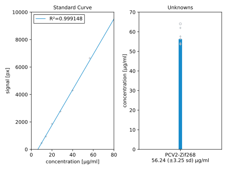

******************
Purify PCV2-Zif268
******************

2021/07/01:

Now that I know that at least some PCV2-Zif268 is solubly expressed, I want to 
try purifying it.  I haven't finished optimizing expression yet, but if my 
yield is good enough, I might not have to.

Planning
========
- Based on the results from :expt:`119`, I'm going to save 10x more of each 
  fraction to run on a gel.

- Only add benzonase to NI/I controls.  Don't want any nuclease in the samples 
  I'm purifying.

- Instead of trying to load the same concentration of sample at each step, I'll 
  just try to load the most sample I can per lane.  I won't be able to compare 
  the intensities of the lanes, but hopefully I'll best be able to see what 's 
  happening at each step.

First Try
=========
.. protocol:: 20210707_purify_pcv2_zif268.pdf 20210707_purify_pcv2_zif268.txt

.. figure:: 20210712_purify_pcv2_zif268.svg

Observations:

- The purification seems to work relatively well.

- The purified protein precipitated after incubating at 4°C for three days.

- Adding benzonase really helped with the induced control.  The sample was 
  still somewhat viscous, but much better than before.

Second Try
==========
I had to repeat the purification because the protein from the first 
purification precipitated.  In addition to promptly transferring the protein to 
storage buffer, I also decided to modify the previous protocol by performing 
the entire purification in Zif268 storage buffer (10 mM tris, 90 mM NaCl, 1 mM 
MgCl₂, 90 µM Zn(OAc)₂, 5 mM DTT, pH=7.5) instead of the purification buffer 
recommended by Qiagen (50 mM NaH₂PO₄, 300 mM NaCl, 0.05% tween-20, pH=8.0).  
Some noteworthy differences between these buffers:

- The storage has Zn and a reducing agent, both of which may help stabilize the 
  fusion protein.  This is what motivated me to make the switch.

- The Qiagen buffer has detergent and more salt, both of which may help reduce 
  nonspecific binding.  High salt could potentially interfere with the native 
  PAGE step of EMSA, however.

- Qiagen recommends against using >100 mM tris or >10 mM DTT, as both are 
  capable of reducing Ni.  The storage buffer is below both limits, but the 
  Qiagen buffer avoids the problem altogether by using phosphate buffer and no 
  reducing agent.

.. protocol:: 20210713_purify_store_pcv2_zif268.pdf 20210713_purify_store_pcv2_zif268.txt

.. figure:: 20210720_purify_pcv2_zif268.svg

Observations:

- The eluate is not as clean as it was previously.  If this turns out to be a 
  problem, adding tween-20 to the purification buffer would probably help.

- My final yield was 3.9 mL at 64 µM.  That should be way more than I'll ever 
  need.

2021/07/21:

Based on my initial attempts to measure Zif268 and PCV2 activity of the 
purified fusion protein, I'm suspicious that the concentration I measured with 
the nanodrop is inaccurate.  To be sure, I want to measure concentration via 
densiometry of a SYPRO Orange stained SDS PAGE gel [Knight2003]_.

.. protocol:: 20210723_measure_conc.txt

.. figure:: 20210723_measure_pcv2_zif268_conc_gel.svg

  Grey numbers in the ladder represent bands that aren't visible in this gel, 
  but that I could roughly position by comparing to other gels with the same 
  ladder.

  Right panel: "plus" symbols show data points with signal inside the linear 
  range of the standard curve; "circle" symbols show data points outside that 
  range.  Only the former are used to calculate the average concentration.

Observations:

- The ladder didn't get stained for some reason.  Maybe it doesn't have an SDS 
  coat?  

- The background was very high in the bottom of the gel.  I think this is most 
  likely the result of using a stain solution that I made ≈1 year ago.  
  However, it's interesting that this may also reflect the fact that more SDS 
  is trapped in the lower part of the gel.

  I was worried that the high background would make the gel uninterpretable, 
  but the background subtraction in ImageJ seemed to work well.  Both the 
  standard curve and the measured concentration seem to have very low variance, 
  which also makes them easier to trust.

- The protein seems to be much less concentrated that I measured with the 
  nanodrop:

  - Nanodrop (after dilution): 1787 µg/mL (64.04 µM)
  - SDS PAGE: 56 µg/mL (2.01 µM)

  This is a 32x difference, and I'm inclined to trust the PAGE data more.  At 
  the concentration indicated by the gel, and assuming my stock of the protein 
  is still 3.9 mL (i.e. assuming the amount I've used so far is negligible), 
  I'd need to concentrate the stock to 122.77 µL to reach 64 µM.  This should 
  be doable with an Amicon spin filter.  I might go for 32 µM (245.53 µL) or 16 
  µM (491.06 µL) instead, depending on how things go.

