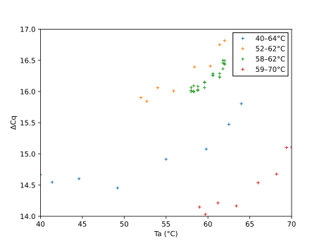

*****************
Pick qPCR primers
*****************

.. update:: 2019/12/18

   I redesigned my plasmids to explicitly include [Subramanian2018]_ PCR 
   primers, so the results of this experiment are no longer relevant.

I am planning to use qPCR to measure whether or not Zif268-binding can protect 
a DNA barcode from DNase treatment.  Ultimately I will want to make this 
measurement using NGS, but qPCR makes more sense for the initial, 
low-throughput, control experiments.

The first step is to find a set of primers and primer concentrations that work 
well for qPCR.  The plasmids I'm working with initially (11 and 15) include an 
explicit reverse primer (skpp-202-R), but no forward primer.  This was an 
oversight on my part, and maybe something I'll correct later.  For now, I just 
designed forward primers to anneal with various parts of the target and barcode 
sequence.

2019/06/04:

I designed primers manually such that each:

- is 20 bp long
- is between 40-60% GC
- has a 3' G or C

The primers anneal to the "Zif268 target" and "DNA barcode" features of the 
plasmid.  The primers are named for the length of the resulting amplicon (e.g.  
"QPCR_51_REV" is a smaller amplicon than "QPCR_57_REV").

.. datatable:: primers.xlsx

2019/06/06:

I did standard PCR to check for clean amplification.  I decided against doing a 
temperature gradient, because I'm not sure that Q5 and the Biorad polymerase 
prefer the same temperatures.  I can do a temperature gradient later on the 
actual qPCR machine.

.. protocol:: 20190604_pcr.txt

   - I used pDBP011 as the template.

.. figure:: 20190606_validate_qpcr_primers.svg

   neg: The negative control, which included template but no primers.  51, 57, 
   60, 67: The primer pairs.  Note that the numbers represent the length of the 
   expected product for each primer pair.  The lanes left of the ladder are 
   from another experiment.

- I wish I'd included a "primer only" lane, to be sure that I'm really seeing a 
  short amplicon and not just unreacted primers.  But I do think size of the 
  bands (as measured by the ladder) is more consistent with a short amplicon 
  than with unreacted primers.

- All of the reactions seemed to be clean and efficient.  But I only want to 
  move forward with one, so I used ImageJ to quantify which lane had the most 
  product.  On this basis, I chose the "60" primer pair.  This could be unfair, 
  because the different intensities could be due to the reactions having 
  different amounts of primer (the primer volume was small and I wasn't careful 
  about pipetting accurately).  But it doesn't really matter if this isn't the 
  optimal choice, as long as it works well.

.. protocol::

   - Subtract background (50 px rolling ball)

   - Draw lanes

   - Count pixels

.. datatable:: 20190606_validate_qpcr_primers.xlsx

   Intensity of the amplified product band for each primer pair, as measured by 
   ImageJ in units of pixels.

2020/08/03:

.. protocol:: 20200803_pcr_pcr.txt

    - Repeats steps 1-2 for 52–62°C.

- I think something is going wrong here, but I don't know what.  It seems like 
  every experiment produces the same basic trend—with the best :math:`C_q` 
  values at the lowest temperatures—regardless of which temperatures were 
  actually used.  It seems unlikely that the ideal annealing temperature is 
  below 52°C.  Some ideas:
  
  - I'm somehow not updating the gradient right.  I don't think this is it, 
    though, because I can open each data file on the qPCR machine and see the 
    right temperatures.

  - Maybe the temperature gradient feature is broken in the BioRad machines?

  - There's some bias going on, e.g. the seal isn't tight, something about the 
    order I'm pipetting in (I've been going from bottom to top), something.

- I don't trust this data, and frankly I think there's something broken with 
  the temperature gradient feature on the BioRad thermocyclers.  I rescaled the 
  data such that for each experiment, the X-axis went from 0 (lowest 
  temperature) to 1 (highest temperature) and the Y-axis was aligned to the 
  lowest Cq for each experiment.  With this scaling, the blue, orange, and red 
  data looked almost identical.  The green data was distinguished by having a 
  smaller range of Cq values.  I really think that, somehow, the same gradient 
  is running each time.
  
2020/09/15:

I decided to try optimizing Ta using regular PCR, since qPCR was giving 
inconsistent results.  One of the reasons I wanted to do this is that I've used 
the Eppendorf thermocycler for gradients before, and I trust it.

.. protocol:: 20200915_pcr.txt

.. figure:: 20200915_optimize_ta_o87_o88.svg

.. datatable:: 20200915_optimize_ta_o87_o88.xlsx

.. datatable:: 20200915_optimize_ta_o87_o88_52_62.xlsx

Note that the 59-70°C gradient was done with Q5, while the 52-62°C gradient was 
done with SsoAdv.  The latter gradient doesn't have a clear trend.  I'm 
inclined to just 60°C---it may not be the optimal Tm, but it is at least 
amplified well.  And I've blown way too much time on this experiment already.
